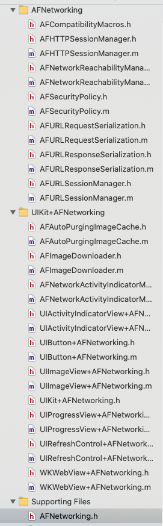

[AFNetworking](https://github.com/AFNetworking/AFNetworking)


### 一  代码结构



主要有5大功能模块:

- 网络通信模块（最核心）（AFURLSessionManager、AFHTTPSessionManager）
- 网络状态监听模块（Reachability）
- 网络通信安全策略模块（Security）
- 网络通信信息序列化/反序列化模块（Serialization）
- 对于iOS UIkit库的拓展（UIKit）

<!--more-->

### 二 AFHTTPSessionManager发起网络请求

首先来看初始化AFHTTPSessionManager对象的过程，其中需要注意的是[AFHTTPSessionManager manager]方法并不是单例，最终调用的是下面初始化方法,工厂设计模式。

在**AFHTTPSessionManager初始化**中主要做了

 1、调用父类初始化方法;

2、给URL加'';

3、给requestSerializer、responseSerializer设置默认值

给url加'/'的目的应该是1、防重发 2、方便在url后面直接拼接参数。


```
- (instancetype)initWithBaseURL:(NSURL *)url
           sessionConfiguration:(NSURLSessionConfiguration *)configuration
{
    self = [super initWithSessionConfiguration:configuration];
    if (!self) {
        return nil;
    }
    // Ensure terminal slash for baseURL path, so that NSURL +URLWithString:relativeToURL: works as expected
    if ([[url path] length] > 0 && ![[url absoluteString] hasSuffix:@"/"]) {
        url = [url URLByAppendingPathComponent:@""];
    }
    self.baseURL = url;
    self.requestSerializer = [AFHTTPRequestSerializer serializer];
    self.responseSerializer = [AFJSONResponseSerializer serializer];
    return self;
}
```


下面来看**AFURLSessionManager初始化**方法。

```
- (instancetype)initWithSessionConfiguration:(NSURLSessionConfiguration *)configuration {
    self = [super init];
    if (!self) {
        return nil;
    }

    if (!configuration) {
        configuration = [NSURLSessionConfiguration defaultSessionConfiguration];
    }

    self.sessionConfiguration = configuration;

    self.operationQueue = [[NSOperationQueue alloc] init];
    self.operationQueue.maxConcurrentOperationCount = 1;

    self.responseSerializer = [AFJSONResponseSerializer serializer];

    self.securityPolicy = [AFSecurityPolicy defaultPolicy];

#if !TARGET_OS_WATCH
    self.reachabilityManager = [AFNetworkReachabilityManager sharedManager];
#endif

    self.mutableTaskDelegatesKeyedByTaskIdentifier = [[NSMutableDictionary alloc] init];

    self.lock = [[NSLock alloc] init];
    self.lock.name = AFURLSessionManagerLockName;

    [self.session getTasksWithCompletionHandler:^(NSArray *dataTasks, NSArray *uploadTasks, NSArray *downloadTasks) {
        for (NSURLSessionDataTask *task in dataTasks) {
            [self addDelegateForDataTask:task uploadProgress:nil downloadProgress:nil completionHandler:nil];
        }

        for (NSURLSessionUploadTask *uploadTask in uploadTasks) {
            [self addDelegateForUploadTask:uploadTask progress:nil completionHandler:nil];
        }

        for (NSURLSessionDownloadTask *downloadTask in downloadTasks) {
            [self addDelegateForDownloadTask:downloadTask progress:nil destination:nil completionHandler:nil];
        }
    }];

    return self;
}
```

主要步骤有：

1. sessionConfiguration 属性持有 configuration ，若传入configuration为空，设置默认defaultSessionConfiguration。包含缓存策略，ID，超时时间 ...
2. 初始化代理方法执行的队列operationQueue，并设置 maxConcurrentOperationCount 值为1。即串行执行
3. responseSerializer 解析方式，
4. securityPolicy 使用defaultPolicy初始化，https证书校验对象，用来校验服务端安全信任链接
5. reachabilityManager 网络状态监听。
6. mutableTaskDelegatesKeyedByTaskIdentifier 类型是NSMutableDictionary，key是NSURLSessionTask的唯一NSUInteger类型标识，value是对应的AFURLSessionManagerTaskDelgate对象
7. lock ，NSLock类型锁创建，为了保证线程安全
8. session对象创建，3.0版本是直接创建。4.0版本是懒加载形式创建，并使用@synchronized互斥锁保证只创建一次
9. session 调用getTasksWithCompletionHandler方法获取 之前的task，创建AFURLSessionManagerTaskDelegate。绑定task，并加入mutableTaskDelegatesKeyedByTaskIdentifier字典中

manager的研究先到这里，里面各种配置的具体实现，暂时先不往深处介绍了，下面来看下request的实现方法


**request方法解析**


```
- (NSURLSessionDataTask *)dataTaskWithHTTPMethod:(NSString *)method
                                       URLString:(NSString *)URLString
                                      parameters:(nullable id)parameters
                                         headers:(nullable NSDictionary <NSString *, NSString *> *)headers
                                  uploadProgress:(nullable void (^)(NSProgress *uploadProgress)) uploadProgress
                                downloadProgress:(nullable void (^)(NSProgress *downloadProgress)) downloadProgress
                                         success:(nullable void (^)(NSURLSessionDataTask *task, id _Nullable responseObject))success
                                         failure:(nullable void (^)(NSURLSessionDataTask * _Nullable task, NSError *error))failure
{
    NSError *serializationError = nil;
    //URLWithString:(NSString *)URLString relativeToURL: 拼接字符串
    //absoluteString完整的url字符串
    NSMutableURLRequest *request = [self.requestSerializer requestWithMethod:method URLString:[[NSURL URLWithString:URLString relativeToURL:self.baseURL] absoluteString] parameters:parameters error:&serializationError];
    for (NSString *headerField in headers.keyEnumerator) {
        [request setValue:headers[headerField] forHTTPHeaderField:headerField];
    }
    if (serializationError) {
        if (failure) {
            dispatch_async(self.completionQueue ?: dispatch_get_main_queue(), ^{
                failure(nil, serializationError);
            });
        }

        return nil;
    }

    __block NSURLSessionDataTask *dataTask = nil;
    dataTask = [self dataTaskWithRequest:request
                          uploadProgress:uploadProgress
                        downloadProgress:downloadProgress
                       completionHandler:^(NSURLResponse * __unused response, id responseObject, NSError *error) {
        if (error) {
            if (failure) {
                failure(dataTask, error);
            }
        } else {
            if (success) {
                success(dataTask, responseObject);
            }
        }
    }];

    return dataTask;
}
```

1、这个过程主要是使用requestSerializer 调用requestWithMethod 或者 multipartFormRequestWithMethod 获取

NSMutableURLRequest 类型的 request 对象。

使用指定的HTTP method和URLString来构建一个NSMutableURLRequest对象实例，如果method是GET、HEAD、DELETE，那parameter将会被用来构建一个基于url编码的查询字符串（query url），并且这个字符串会直接加到request的url后面。对于其他的Method，比如POST/PUT，它们会根据parameterEncoding属性进行编码，而后加到request的http body中。


```
- (NSMutableURLRequest *)requestWithMethod:(NSString *)method
                                 URLString:(NSString *)URLString
                                parameters:(id)parameters
                                     error:(NSError *__autoreleasing *)error
```

在上面这个方法里设置了request的 请求方法，url，遍历mutableObservedChangedKeyPaths中设置的属性并给Request赋值。

调用[mutableRequest setValue:value forHTTPHeaderField:field]方法设置请求头相关信息。

非HTTPMethodsEncodingParametersInURI的请求先判断request的Content-Type是否设置了，如果没有，就默认设置为application/x-www-form-urlencoded。

在方法 multipartFormRequestWithMethod 中比 requestWithMethod 多了个参数为formData 的 block 对象参数。在方法体里面对formData 进行拼接。然后通过block传出去。此处设计与Masonry框架中block使用方式相同，可以放一块研究一下。

2、调用 dataTaskWithRequest 方法，使用上面的 request 生成 task 对象。


```
NSURLSessionDataTask *dataTask = [self.session dataTaskWithRequest:request];
[self addDelegateForDataTask:dataTask uploadProgress:uploadProgressBlock downloadProgress:downloadProgressBlock completionHandler:completionHandler];
```

addDelegateForDataTask 方法将初始化一个 AFURLSessionManagerTaskDelegate 对象，delegate 弱引用又持有了 manager, 打破闭环。在delegate中有 进度，回调，存储数据的mutableDate等属性。

在addDelegateForDataTask 中调用 setDelegate：forTask 将task 和 delegate 绑定到一起。

在setDelegate:forTask 方法中

 1、将delegate存入字典，以taskid作为key，说明每个task都有各自的代理；

 2、设置两个NSProgress的变量 - uploadProgress和downloadProgress，给session task添加了两个KVO事件

设置这两个NSProgress对应的cancel、pause和resume这三个状态，正好对应session task的cancel、suspend和resume三个状态

当NSURLSessionTask调用resume函数时，会postNotificationName:AFNSURLSessionTaskDidResumeNotification，从而执行taskDidResume:方法

在 taskDidResume: 方法中会判断task是否是当前manager管理的，是的话会发送通知AFNetworkingTaskDidResumeNotification

3、task调用resume 执行

resume 方法被 使用 method_exchangeImplementations交换为 af_resume方法。内部发送了AFNSURLSessionTaskDidResumeNotification 通知。


参考文章:

https://juejin.cn/user/3729141714925687/posts