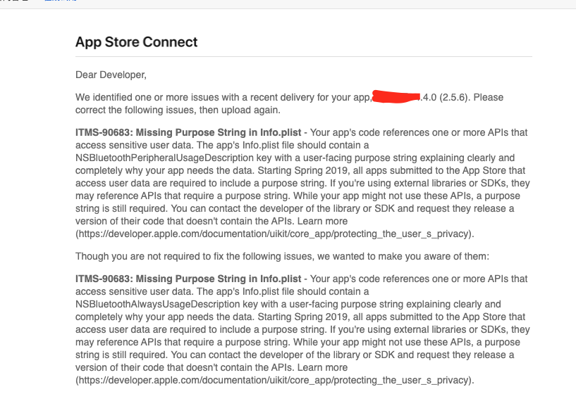
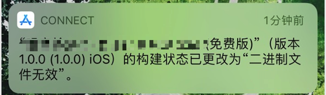

使用了以下方法排查,最后还是提示"二进制文件无效",也不能查看到原因,后来想到了会不会把具体原因发到邮箱了,后来在邮箱里看到了原因提示,这样就能精准定位了,不用一个个去排查了.

<!--more-->

**原来是前段时间要用到蓝牙,我把一个蓝牙工具类放进去了,因为暂时没用到忘记添加权限plist说明了,捣鼓了半天把下面的全部试了一遍,嗨....**

**参考文章:**

上传了新版本，收到信息 二进制文件无效 。但是在AppStoreConnect看不到被拒原因。

这是我收到的仅有的提示信息

二进制文件无效可能的原因:

一. 项目中使用了系统某些权限（相机，相册，麦克风等），但是在info.plist中没有添加

二. 使用私有API或IDFA

三. scheme设置

四. app图标修改相关

五. UIWebView等废弃API

一. 项目中使用了系统某些权限（相机，相册，麦克风等），但是在info.plist中没有添加

这个是我遇到的问题，代码使用权限，需要在info.plist做配置

权限都要弹框提示,隐私数据对应key值提示语必须说出指明用途,否则上线会被拒绝

参考链接1 这位帖主提醒我检测权限

参考链接2 这位贴主告诉我得配置提示语

左边为加了提示语后的正确权限请求框

二. 使用私有API或IDFA

1、 cd 到你的工程目录

2、使用全局搜索命令(注意最后要加一个点)

grep -r lockcomplete .

1

参考链接1 提示可能原因和检测方式

参考链接2 检测私有方法

参考链接3 检测私有方法

三. scheme设置

Product ---->Scheme---->editScheme，然后把最后两项都改为release

四. app图标修改相关

参考链接

五. UIWebView等废弃API

在项目中全局搜索

————————————————

版权声明：本文为CSDN博主「时光不染」的原创文章，遵循CC 4.0 BY-SA版权协议，转载请附上原文出处链接及本声明。

原文链接：https://blog.csdn.net/hzhnzmyz/article/details/114931053
