## 一、Node

### 1.1简介

Node.js 是 JavaScript 的后端运行环境

Node.js官网 **https://nodejs.org**

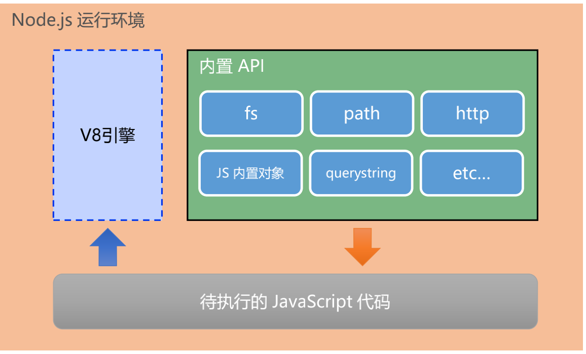

<!--more-->

查看node.js版本号中断指令

node –v

**内置API**

fs 模块是 Node.js 官方提供的、用来操作文件的模块。

path 模块是 Node.js 官方提供的、用来处理路径的模块。

http 模块是 Node.js 官方提供的、用来创建 web 服务器的模块。


### 1.2 http创建最基本的web服务器

1. 获取请求url
2. 设置未处理的响应内容为404页面
3. 判断用户请求的是否为/或/index.html首页
4. 根据不同url响应不同的html内容
5. 设置Content-Type响应头,防止中文乱码
6. 使用res.end()把内容响应给客户端

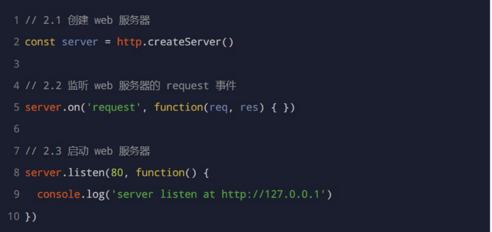


## 二、模块化

**包管理指令**

1.快速创建 package.json

```c
npm init -y
```

2.安装依赖包

```c
npm install  //npm i 一次性安装项目依赖的所有包
npm i 包名  //核心依赖包 会记录到dependencies节点
```

3.卸载制定的包

```c
npm uninstall 包名
```

4.安装只在项目开发阶段使用的包

```c
npm i 包名 -D
等价于 npm install 包名 --save-dev
```

5.安装全局包

```c
npm i 包名 -g
```


**切换下载源**

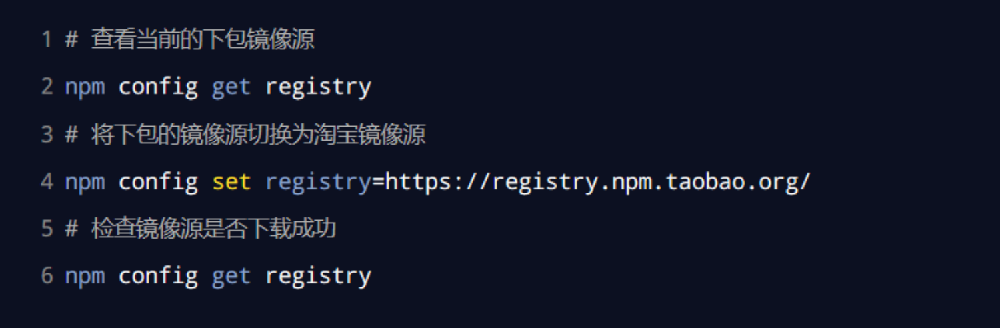

**nrm工具**

```c
全局安装nrm工具
npm i nrm -g
#查看所有可用的镜像源
nrm ls
切换镜像源
nrm use taobao
```


**开发自定义npm包**

1. 新建自定义包文件夹，作为根目录
2. 在根目录新建如下3个文件：

package.json (包管理配置文件)

index.js (包的入口文件)

README.md （包的说明文件）

1. 创建功能模块
2. index.js导入功能模块，module.exports共享出去
3. 发布包https://www.npmjs.com/

```c
//把包发布到npm,终端切换到包根目录执行
npm publish
删除已发布的包
npm unpublish 包名 --force
```


## 三、Express

### 1.使用

是基于Node.js平台，构建的专门用来创建web服务器的http://www.expressjs.com.cn/

**常见的两种服务器：**

- - web网站服务器
  - api接口服务器


**安装**

项目目录运行如下命令：

```c
npm i express
```

**创建基本的web服务器**

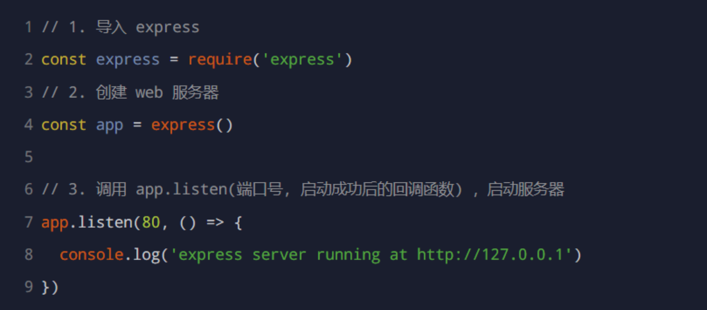

**托管静态资源**

创建一个静态资源服务器，例如：通过如下代码将public目录下的资源对外开放访问，存放静态文件的目录不会出现在url中

```c
app.use(express.static('pubic))
```

**挂载路径前缀**

```c
app.use('/public',express.static('pubic))
```

### 2.路由

路由就是映射关系，在express指的是**客户端的请求和服务器处理函数之间的映射关系**

express中路由有三部分组成，分别是**请求的类型、请求的url地址、处理函数**

```c
app.METHOD(PATH,HANDLER)
```

**路由匹配过程**

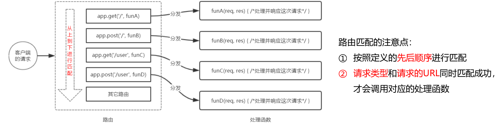

**模块化路由使用**

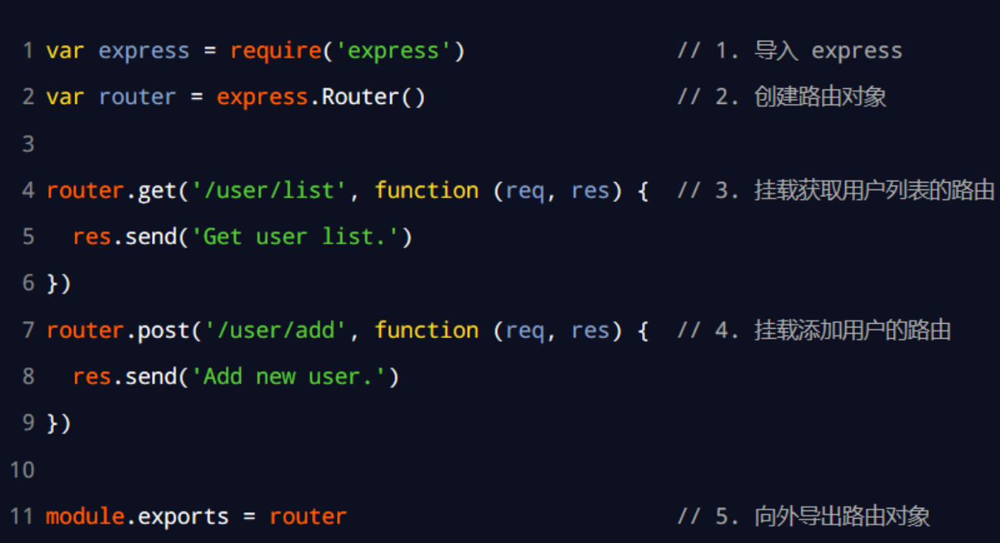

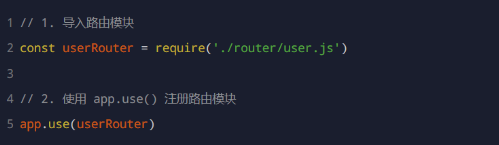

**为路由模块添加前缀**

```c
app.use('/api',userRouter)
```

### 3.中间件

特指业务流程的中间处理环节。

**express的中间件本质就是一个function处理函数**

**定义中间件函数**

```c
const mw = function (req,res,next) {
    console.log('这是一个简单地中间件函数')
        
  next()       
 }
```

**全局中间件**

```c
app.use(function(req,res,next){
    next()
})
```

**局部中间件**

```c
const mw = function(req,res,next){
    console.log('这是中间件函数')
    next()
}

app.get('/',mw,function(req,res){
    res.send('home page')
})

 //mw不影响下面这个路由
app.get('/user',function(req,res){
    res.send('user page')
})
    
//定义多个局部中间件
  app.get('/',[nm1,nw2],(req,res){
        res.send('')
    })
    
    app.get('/',nm1,nw2,(req,res){
        res.send('')
    })
```

**多个中间件共享同一份req和res**

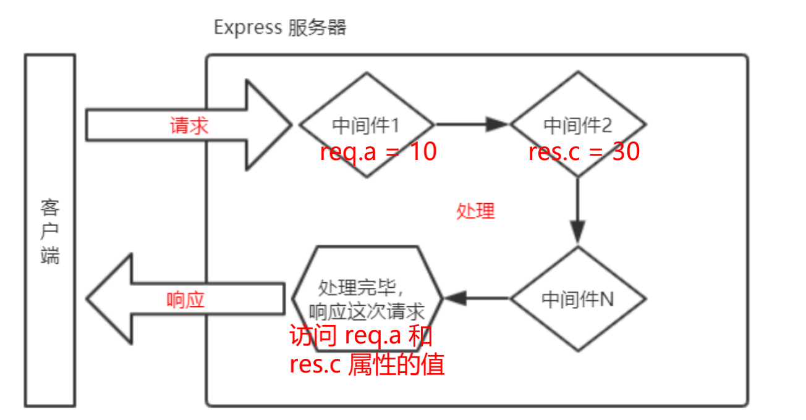

**中间件使用注意事项**

1. 一定要在路由之前注册中间件
2. 客户端发送过来的请求，可以连续调用多个中间件处理
3. 执行完中间件的业务代码后，不要忘记调用next()函数
4. 防止代码逻辑，调用next()函数后不要再写额外的代码
5. 连续调用多个中间件时，多个中间件之间，共享req和res对象


### 工具

**nodemon**   https://www.npmjs.com/package/nodemon

它能够监听node项目文件改动，当代吗修改后自动帮我们重启项目

```c
//安装
npm install -g nodemon
//使用
nodemon app.js
```


## 四、接口跨域问题解决方案

- CORS(推荐)
- JSONP


**CORS**

CORS由一系列http响应头组成，这些http响应头决定浏览器是否组织前端js代码跨域获取资源。

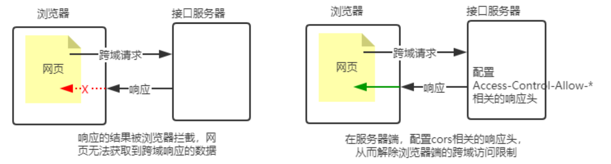


**使用cors步骤**

1. npm install cors 安装中间件
2. const cors = require('cors')  导入中间件
3. 在路由之前调用 app.use(cors())  配置中间件


**JSONP**

浏览器端通过 <script> 标签的 src 属性，请求服务器上的数据，同时，服务器返回一个函数的调用。这种请求数据 的方式叫做 JSONP。

特点： 

① JSONP 不属于真正的 Ajax 请求，因为它没有使用 XMLHttpRequest 这个对象。 

② JSONP 仅支持 GET 请求，不支持 POST、PUT、DELETE 等请求。


## 五、数据库

### 1.1 简介

**数据库是用来组织、存储和管理数据的仓库**


**常见的数据库及分类**

-  MySQL 数据库（目前使用最广泛、流行度最高的开源免费数据库；Community + Enterprise） 
- Oracle 数据库（收费） 
-  SQL Server 数据库（收费） 
-  Mongodb 数据库（Community + Enterprise） 

其中，MySQL、Oracle、SQL Server 属于传统型数据库（又叫做：关系型数据库 或 SQL 数据库），这三者的 

设计理念相同，用法比较类似。 

而 Mongodb 属于新型数据库（又叫做：非关系型数据库 或 NoSQL 数据库），它在一定程度上弥补了传统型 

数据库的缺陷。


MySQL安装: https://dev.mysql.com/downloads/mysql/

MySQL Workbench：可视化的 MySQL 管理工具.


### 1.2 SQL

结构化查询语言，专门用来访问和处理数据库的编程语言。能够让我们以编程的形势，操作数据库里面的数据。


- SQL是一门**数据库编程语言**
- 使用SQL语言编写出来的代码，叫做**SQL语句**
- SQL语言**只能在关键型数据库中使用**（例如MySQL、Oracle、SQL Server）。非关系型数据库不支持SQL语言


### 1.3 项目中使用mysql


1. 安装操作 MySQL 数据库的第三方模块（mysql）

```c
npm install mysql
```

1. 通过 mysql 模块连接到 MySQL 数据库

```c
const mysql = require('mysql')

const db = mysql.createPool({
    host: 'localhost',
    user: 'root',
    password: 'admin123',
    database: 'api_server',
    port: 3306
})
```

1. 通过 mysql 模块执行 SQL 语句

```c
    const sql = `select 1`
    db.query(sql,(err,results) => {
        if(err) return res.send({status: 1, message:err.message})
        res.send({
            status: 0,
            message: '获取成功！',
            data: results
        })
    })
```

## 六 前后端身份认证

### 6.1 web开发模式

主流有两种,分别是:

1. 基于服务端渲染的传统 Web 开发模式:  服务器发送给客户端的 HTML 页面，是在服务器通过字符串的拼接，动态生成的
2. 基于前后端分离的新型 Web 开发模式: 后端只负责提供 API 接口，前端使用 Ajax 调用接口的开发模式


**服务端渲染的优缺点** 

**优点：** 

1. 前端耗时少。因为服务器端负责动态生成 HTML 内容，浏览器只需要直接渲染页面即可。尤其是移动端，更省电。 
2. 有利于SEO。因为服务器端响应的是完整的 HTML 页面内容，所以爬虫更容易爬取获得信息，更有利于SEO。 

**缺点：** 

1. 占用服务器端资源。即服务器端完成 HTML 页面内容的拼接，如果请求较多，会对服务器造成一定的访问压力。 
2. 不利于前后端分离，开发效率低。使用服务器端渲染，则无法进行分工合作，尤其对于前端复杂度高的项目，不利于 项目高效开发。


**前后端分离的优缺点** 

**优点：** 

1.  开发体验好。前端专注于 UI 页面的开发，后端专注于api 的开发，且前端有更多的选择性。 
2. 用户体验好。Ajax 技术的广泛应用，极大的提高了用户的体验，可以轻松实现页面的局部刷新。 
3. 减轻了服务器端的渲染压力。因为页面最终是在每个用户的浏览器中生成的。 

**缺点：** 

1. 不利于 SEO。因为完整的 HTML 页面需要在客户端动态拼接完成，所以爬虫对无法爬取页面的有效信息。（解决方案：利用 Vue、React 等前端框架的 SSR （server side render）技术能够很好的解决 SEO 问题！）


### 6.2 前后端身份认证

身份认证（Authentication）又称“身份验证”、“鉴权”，是指通过一定的手段，完成对用户身份的确认。 


不同开发模式下的身份认证

1. 服务端渲染推荐使用 Session 认证机制 
2. 前后端分离推荐使用 JWT 认证机制


**Session的工作原理**

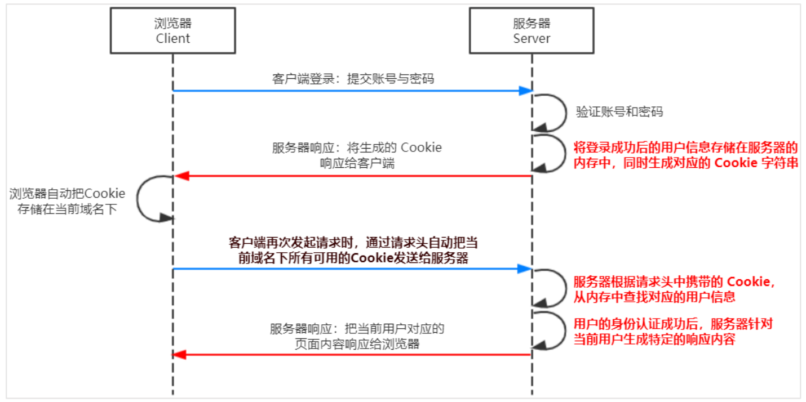

在 Express 项目中，可以安装 express-session 中间件


**Session 认证的****局限性** 

Session 认证机制需要配合 Cookie 才能实现。由于 Cookie 默认不支持跨域访问，所以，当涉及到前端跨域请求后端接口的时候，需要做很多额外的配置，才能实现跨域 Session 认证


注意： 

- 当前端请求后端接口不存在跨域问题的时候，推荐使用 Session 身份认证机制。 
- 当前端需要跨域请求后端接口的时候，不推荐使用 Session 身份认证机制，推荐使用 JWT 认证机制。


**JWT的工作原理**

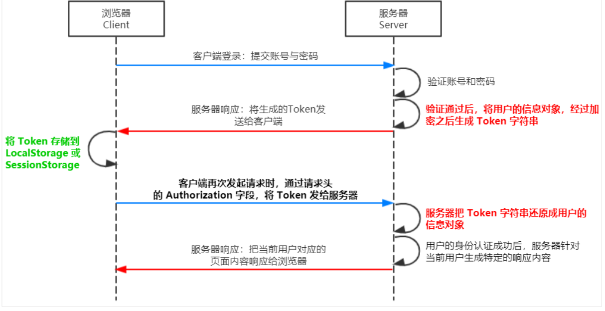

在 Express 项目中，可以安装 jsonwebtoken  、  express-jwt 组件 使用JWT


**jsonwebtoken** 用于生成 JWT 字符串 

**express-jwt** 用于将 JWT 字符串解析还原成 JSON 对象

