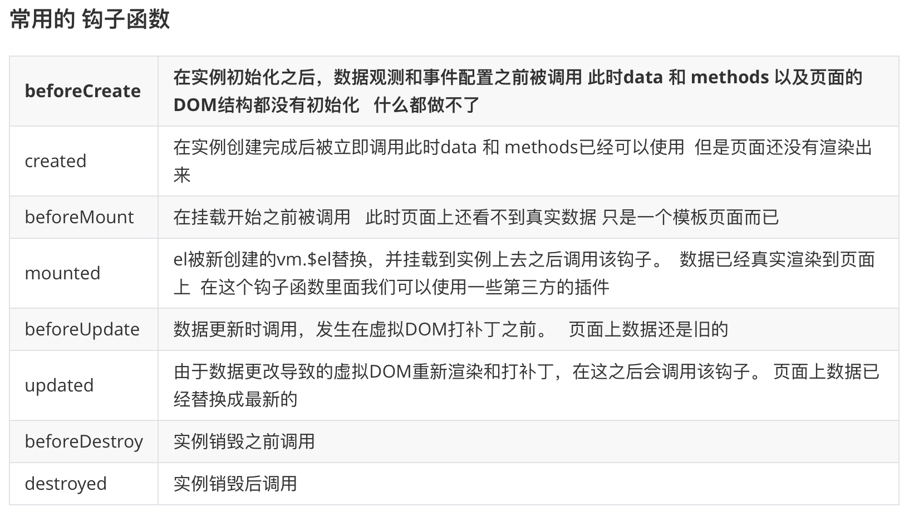
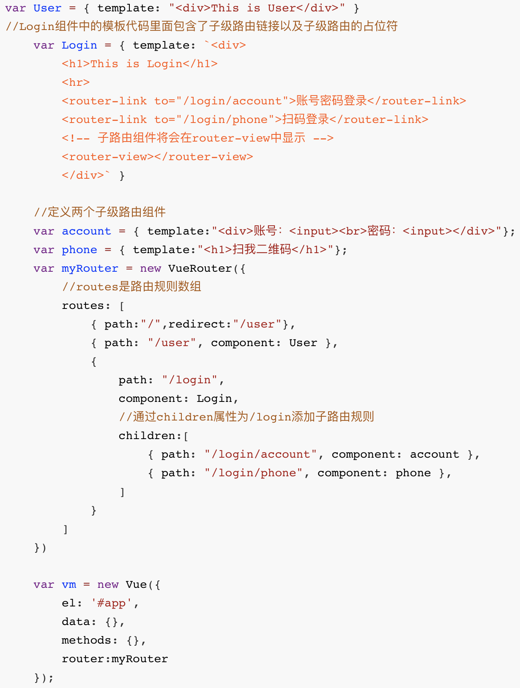
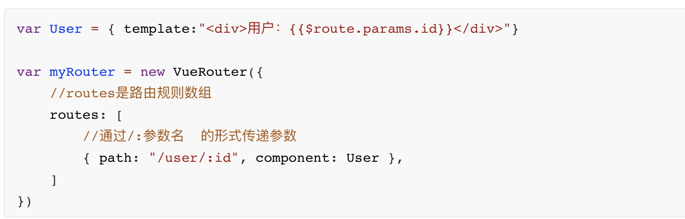
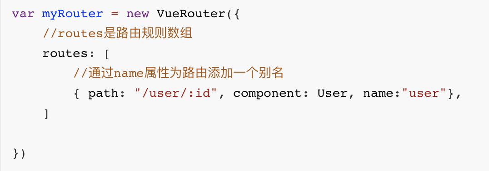

# Vue.js基础

Vue (读音类似于 view) 是一套用于构建用户界面的渐进式框架

Vue 的核心库只关注视图层，不仅易于上手，还便于与第三方库或既有项目整合

## 指令

- 本质就是自定义属性
- Vue中指令都是以 v- 开头 

### 内置指令

- v-cloak

  - 防止页面加载时出现闪烁问题

- v-text

  -  v-text指令用于将数据填充到标签中，作用于插值表达式类似，但是没有闪动问题
  -  如果数据中有HTML标签会将html标签一并输出
  -  注意：此处为单向绑定，数据对象上的值改变，插值会发生变化；但是当插值发生变化并不会影响数据对象的值

- v-html

  - 用法和v-text 相似  但是他可以将HTML片段填充到标签中

  - 可能有安全问题, 一般只在可信任内容上使用 `v-html`，永不用在用户提交的内容上

  - 它与v-text区别在于v-text输出的是纯文本，浏览器不会对其再进行html解析，但v-html会将其当html标签解析后输出。

    <!-- more -->

- v-pre

  - 显示原始信息跳过编译过程
  - 跳过这个元素和它的子元素的编译过程。
  - 一些静态的内容不需要编译加这个指令可以加快渲染

- v-once

  - 执行一次性的插值【当数据改变时，插值处的内容不会继续更新】

- v-model

  - v-model是一个指令，限制在 `<input>、<select>、<textarea>、components`中使用
  - 双向数据绑定

    - 当数据发生变化的时候，视图也就发生变化
    - 当视图发生变化的时候，数据也会跟着同步变化

- v-on

  - 用来绑定事件的
  - 形式如：v-on:click  缩写为 @click;

- v-bind

  - v-bind 指令被用来响应地更新 HTML 属性
  - v-bind:href    可以缩写为    :href;
  - 

    - <!-- 缩写 -->

      - 

- 条件判断

  - v-if

    - 使用场景

      - 多个元素 通过条件判断展示或者隐藏某个元素。或者多个元素
      - 进行两个视图之间的切换

    - v-show 和 v-if的区别

      - v-show本质就是标签display设置为none，控制隐藏
      - v-show只编译一次，后面其实就是控制css，而v-if不停的销毁和创建，故v-show性能更好一点。
      - v-if是动态的向DOM树内添加或者删除DOM元素
      - v-if切换有一个局部编译/卸载的过程，切换过程中合适地销毁和重建内部的事件监听和子组件

- 循环结构

  - v-for

    - 用于循环的数组里面的值可以是对象，也可以是普通元素  
    - key 的作用

      - key来给每个节点做一个唯一标识
      - key的作用主要是为了高效的更新虚拟DOM

### 自定义指令

- 介绍

  - -内置指令不能满足我们特殊的需求
  - Vue允许我们自定义指令

- Vue.directive  注册全局指令

- Vue.directive  注册全局指令 带参数

- 自定义指令局部指令

  - 局部指令，需要定义在  directives 的选项   用法和全局用法一样 
  - 局部指令只能在当前组件里面使用
  - 当全局指令和局部指令同名时以局部指令为准

## 修饰符

### 事件修饰符

- 在事件处理程序中调用 `event.preventDefault()` 或 `event.stopPropagation()` 是非常常见的需求。
- Vue 不推荐我们操作DOM    为了解决这个问题，Vue.js 为 `v-on` 提供了事件修饰符
- -修饰符是由点开头的指令后缀来表示的

### 按键修饰符

- 在做项目中有时会用到键盘事件，在监听键盘事件时，我们经常需要检查详细的按键。Vue 允许为 `v-on` 在监听键盘事件时添加按键修饰符

### 自定义按键修饰符别名

- 在Vue中可以通过`config.keyCodes`自定义按键修饰符别名

### 表单修饰符

- .number  转换为数值

  - 注意点

    -   - 当开始输入非数字的字符串时，因为Vue无法将字符串转换成数值
    -   - 所以属性值将实时更新成相同的字符串。即使后面输入数字，也将被视作字符串。

- .trim  自动过滤用户输入的首尾空白字符

  -   只能去掉首尾的 不能去除中间的空格

- .lazy   将input事件切换成change事件

  -    .lazy 修饰符延迟了同步更新属性值的时机。即将原本绑定在 input 事件的同步逻辑转变为绑定在 change 事件上

- 在失去焦点 或者 按下回车键时才更新

## 计算属性

 **computed**

模板中放入太多的逻辑会让模板过重且难以维护  使用计算属性可以让模板更加的简洁

计算属性是基于它们的响应式依赖进行缓存的

 computed比较适合对多个变量或者对象进行处理后返回一个结果值，也就是数多个变量中的某一个值发生了变化则我们监控的这个值也就会发生变化

## 侦听器

### watch

使用watch来响应数据的变化

 一般用于异步或者开销较大的操作

 watch 中的属性 一定是data 中 已经存在的数据 

 当需要监听一个对象的改变时，普通的watch方法无法监听到对象内部属性的改变，只有data中的数据才能够监听到变化，此时就需要deep属性对对象进行深度监听

## 过滤器

### 介绍

- Vue.js允许自定义过滤器，可被用于一些常见的文本格式化

### 使用场景

- 过滤器可以用在两个地方：双花括号插值和v-bind表达式。
- 过滤器应该被添加在JavaScript表达式的尾部，由“管道”符号指示
- 支持级联操作

### 注意点

- 过滤器不改变真正的`data`，而只是改变渲染的结果，并返回过滤后的版本
- 全局注册时是filter，没有s的。而局部过滤器是filters，是有s的

### 过滤器中传递参数

## 生命周期

### 介绍

- 事物从出生到死亡的过程
- Vue实例从创建 到销毁的过程 ，这些过程中会伴随着一些函数的自调用。我们称这些函数为钩子函数

### 生命周期钩子函数

## 组件

### 介绍

- 组件 (Component) 是 Vue.js 最强大的功能之一
- 组件可以扩展 HTML 元素，封装可重用的代

### 组件注册

- 全局注册

  - Vue.component('组件名称', { })     第1个参数是标签名称，第2个参数是一个选项对象
  - 全局组件注册后，任何vue实例都可以用
  - 用法

  - 注意事项

    - 组件参数的data值必须是函数同时这个函数要求返回一个对象 
    - 组件模板必须是单个根元素
    - 组件模板的内容可以是模板字符串
- 局部注册

  - 只能在当前注册它的vue实例中使用

### Vue组件之间传值

- 父组件向子组件传值

  - 父组件发送的形式是以属性的形式绑定值到子组件身上。
  - 然后子组件用属性props接收
  - 在props中使用驼峰形式，模板中需要使用短横线的形式字符串形式的模板中没有这个限制
- 子组件向父组件传值

  - 子组件用`$emit()`触发事件
  - `$emit()`  第一个参数为 自定义的事件名称     第二个参数为需要传递的数据
  - 父组件用v-on 监听子组件的事件
- 兄弟之间的传递

  - 兄弟之间传递数据需要借助于事件中心，通过事件中心传递数据   
  - 提供事件中心    var hub = new Vue()
  - 传递数据方，通过一个事件触发hub.$emit(方法名，传递的数据)
  - 接收数据方，通过mounted(){} 钩子中  触发hub.$on()方法名
  - 销毁事件 通过hub.$off()方法名销毁之后无法进行传递数据

### 组件插槽

- 介绍

  - 组件的最大特性就是复用性，而用好插槽能大大提高组件的可复用能力

- 匿名插槽

- 具名插槽

  - 具有名字的插槽 
  - 使用 <slot> 中的 "name" 属性绑定元素
- 作用域插槽

  - 父组件对子组件加工处理
  - 既可以复用子组件的slot，又可以使slot内容不一致

## 路由

### 概念

- 路由的本质就是一种对应关系，比如说我们在url地址中输入我们要访问的url地址之后，浏览器要去请求这个url地址对应的资源。
  那么url地址和真实的资源之间就有一种对应的关系，就是路由。
- 路由分为前端路由和后端路由

  - 1).后端路由是由服务器端进行实现，并完成资源的分发

    - 后端路由性能相对前端路由来说较低，所以，我们接下来主要学习的是前端路由

  - 2).前端路由是依靠hash值(锚链接)的变化进行实现 

    - 前端路由的基本概念：根据不同的事件来显示不同的页面内容，即事件与事件处理函数之间的对应关系
    - 前端路由主要做的事情就是监听事件并分发执行事件处理函数

### Vue Router

- 简介

  - 它是一个Vue.js官方提供的路由管理器。是一个功能更加强大的前端路由器，推荐使用。
    Vue Router和Vue.js非常契合，可以一起方便的实现SPA(single page web application,单页应用程序)应用程序的开发。
  - Vue Router依赖于Vue，所以需要先引入Vue，再引入Vue Router

- Vue Router的特性：

  - 支持H5历史模式或者hash模式
  - 支持嵌套路由
  - 支持路由参数
  - 支持编程式路由
  - 支持命名路由
  - 支持路由导航守卫
  - 支持路由过渡动画特效
  - 支持路由懒加载
  - 支持路由滚动行为

- Vue Router的使用步骤

  - 1、导入js文件

    - 

    - 

  - 2、添加路由链接:<router-link>是路由中提供的标签，默认会被渲染为a标签，to属性默认被渲染为href属性，to属性的值会被渲染为#开头的hash地址

    - <router-link to="/user">User</router-link>

  - 3、添加路由填充位（路由占位符）

    - <router-view></router-view>

  - 4、定义路由组件

    - var User = { template:"
This is User
" }

  - 5、配置路由规则并创建路由实例

    - var myRouter = new VueRouter({
      //routes是路由规则数组
      routes:[
        //每一个路由规则都是一个对象，对象中至少包含path和component两个属性
        //path表示  路由匹配的hash地址，component表示路由规则对应要展示的组件对象
        {path:"/user",component:User},
        {path:"/login",component:Login}
      ]
      })

  - 6、将路由挂载到Vue实例中

    - new Vue({
      el:"#app",
      //通过router属性挂载路由对象
      router:myRouter
      })

  - 补充：

    - 路由重定向：可以通过路由重定向为页面设置默认展示的组件
      在路由规则中添加一条路由规则即可，如

      - var myRouter = new VueRouter({
        //routes是路由规则数组
        routes: [
        //path设置为/表示页面最初始的地址 / ,redirect表示要被重定向的新地址，设置为一个路由即可
        { path:"/",redirect:"/user"},
        { path: "/user", component: User },
        { path: "/login", component: Login }
        ]
        })

- 分类

  - 嵌套路由

    - 嵌套路由最关键的代码在于理解子级路由的概念：
      比如我们有一个/login的路由
      那么/login下面还可以添加子级路由，如:
      /login/account
      /login/phone
    - 
  - 动态路由
  - 
    - 补充：

      - 1.我们可以通过props来接收参数

      - 2、还有一种情况，我们可以将props设置为对象，那么就直接将对象的数据传递给
        组件进行使用

      - 3、如果想要获取传递的参数值还想要获取传递的对象数据，那么props应该设置为
        函数形式。
  - 命名路由

    - 给路由取别名
    - 
  - 编程式导航

    - 调用js的api方法实现导航

      - this.$router.push("hash地址");
      - this.$router.push("/login");
      - this.$router.push({ name:'user' , params: {id:123} });
      - this.$router.push({ path:"/login" });
      - this.$router.push({ path:"/login",query:{username:"jack"} });
      - this.$router.go( n );//n为数字，参考history.go
      - this.$router.go( -1 );
