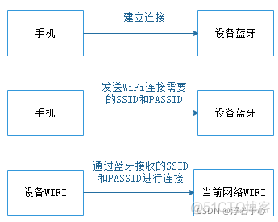
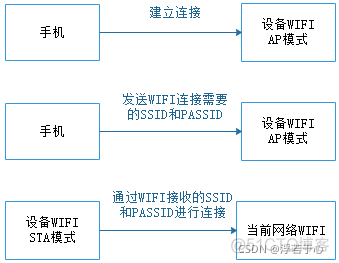
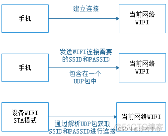

**WIFI配网方案：1、蓝牙配网 2、WIFI自身配网 3、SmartConfig一键配网**

蓝牙配网：
顾名思义，通过蓝牙给WIFI配网，过程相对较为简单，首先设备上具有WIFI和蓝牙两种功能。然后通过手机的小程序或者APP连接产品蓝牙，连接之后发送WIFI连接所需要的SSID和PASSID。产品接收到蓝牙信息后，产品WIFI通过SSID和PASSID去进行WIFI的连接。

流程示意图：

<!--more-->

WIFI自身配网：
此过程也比较简单，首先设置当前WIFI为AP+STA模式。然后通过手机的小程序或者APP连接上产品在AP模式下的WIFI。连接之后发送产品需要连接的WIFI的SSID和PASSID。产品接收到SSID和PASSID信息后，产品WIFI通过SSID和PASSID去进行WIFI的连接。

流程示意图：

SmartConfig一键配网：
1、手机的APP或者小程序先连接上一个现场的局域网网络也就是一个WIFI。

 2、被配网的设备需要开启混杂模式。混杂模式又叫偷听模式，允许节点接收它能侦听到的所有数据包。

3、手机的APP或者小程序通过连接的局域网WIFI，进行UDP数据的广播或者组播进行一个循环发送，数据包里面包含了需要连接WIFI的SSID和PASSID。

4、被配网的设备通过 UDP 包（长度）获取配置信息捕捉到 需要连接WIFI的SSID和PASSID，最后连接路由器。（广播根据 UDP 包长度，组播根据 IP 地址信息）

 流程示意图：

**知识扩展：**

**1、TCP和UDP连接过程：**
TCP编程的服务器端一般步骤是：
1、创建一个socket，用函数socket()； 
2、设置socket属性，用函数setsockopt(); * 可选 
3、绑定IP地址、端口等信息到socket上，用函数bind(); 
4、开启监听，用函数listen()； 
5、接收客户端上来的连接，用函数accept()； 
6、收发数据，用函数send()和recv()，或者read()和write(); 
7、关闭网络连接； 
8、关闭监听； 

TCP编程的客户端一般步骤是： 
1、创建一个socket，用函数socket()； 
2、设置socket属性，用函数setsockopt();* 可选 
3、绑定IP地址、端口等信息到socket上，用函数bind();* 可选 
4、设置要连接的对方的IP地址和端口等属性； 
5、连接服务器，用函数connect()； 
6、收发数据，用函数send()和recv()，或者read()和write(); 
7、关闭网络连接；

UDP编程的服务器端一般步骤是： 
1、创建一个socket，用函数socket()； 
2、设置socket属性，用函数setsockopt();* 可选 
3、绑定IP地址、端口等信息到socket上，用函数bind(); 
4、循环接收数据，用函数recvfrom(); 
5、关闭网络连接； 

**UDP编程的客户端一般步骤是：** 
1、创建一个socket，用函数socket()； 
2、设置socket属性，用函数setsockopt();* 可选 
3、绑定IP地址、端口等信息到socket上，用函数bind();* 可选 
4、设置对方的IP地址和端口等属性; 
5、发送数据，用函数sendto(); 
6、关闭网络连接；

2、单播、广播、组播
1、单播：单台主机与单台主机之间的通信；

2、广播：单台主机与网络中所有主机的通信；

3、组播（多播）：单台主机与选定的一组主机的通信；

 多播首先要知道的是只有UDP有多播，没有TCP多播。因为多播的重点是高效的把同一个包尽可能多的发送到不同的，甚至可能是未知的设备。但是TCP连接可能要求丢包重发或者延时或重组顺序，这些操作可能非常消耗资源，不适于许多使用多播的应用场景。（同时多播不知道发出的包是不是已经到达，这个也导致不能使用TCP）。

同样广播也是属于UDP，TCP属于端对端的通信，通信要求比较严格。

©著作权归作者所有：来自51CTO博客作者浮若于心的原创作品，https://blog.51cto.com/u_15427821/4581200
