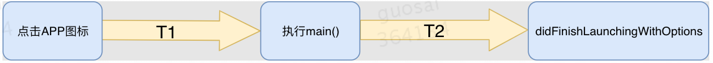
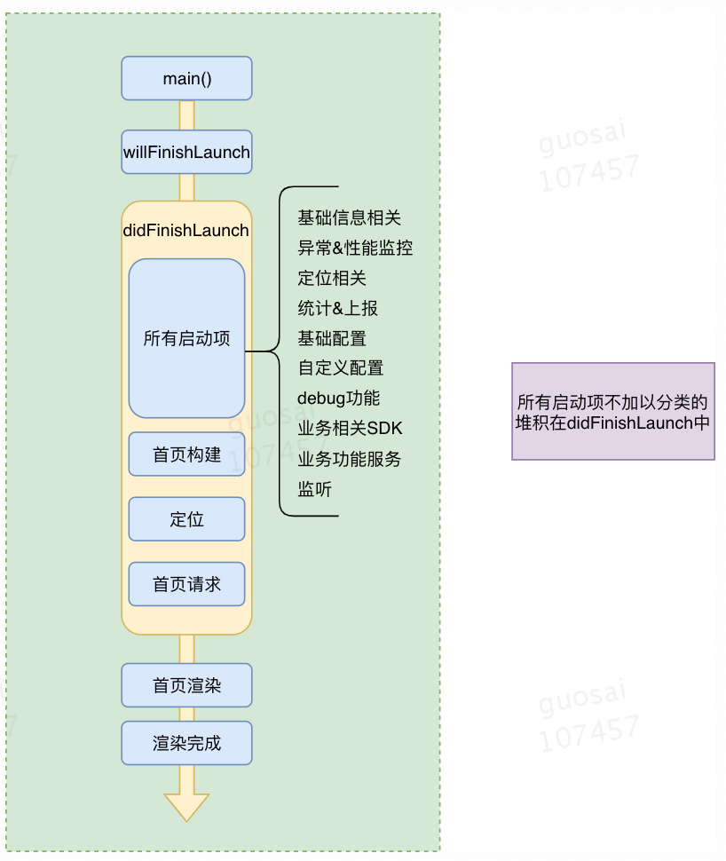
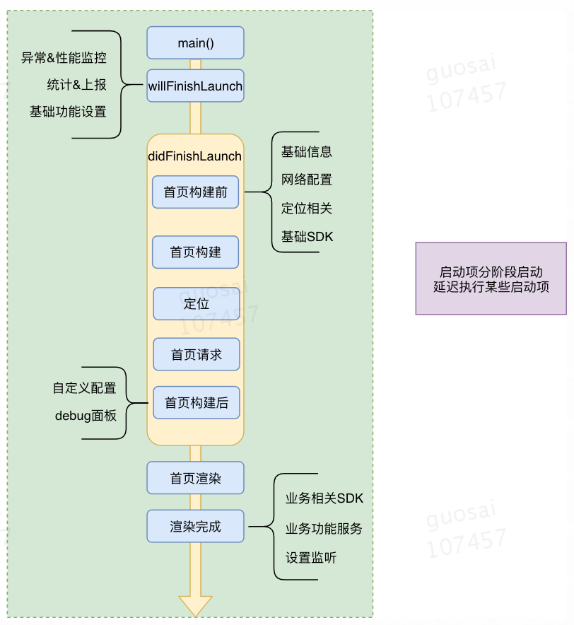
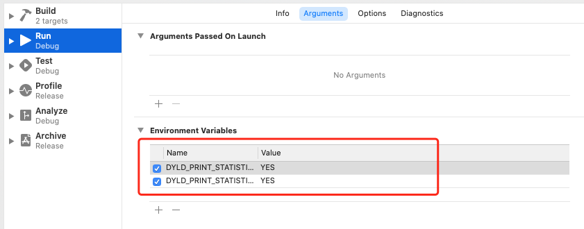
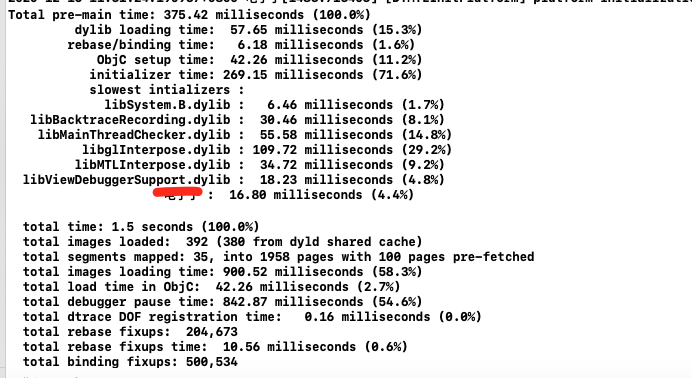

**启动分类:**

1.冷启动: 从用户点击App图标开始到appDelegate didFinishLaunching方法执行完成为止。这是一次完整的启动过程。

2.热启动:App 在冷启动后用户将 App 退后台，在 App 的进程还在系统里的情况下，用户重新启动进入 App 的过程，这个过程做的事情非常少。

**启动主要步骤:**

- T1：main()函数之前，即操作系统加载App可执行文件到内存，然后执行一系列的加载&链接等工作，最后执行至App的main()函数。

- T2：main()函数之后，即从main()开始，到appDelegate的didFinishLaunchingWithOptions方法执行完毕。
  

- T3:当didFinishLaunchingWithOptions执行完成时，用户还没有看到App的主界面，也不能开始使用App。这个阶段会一般会首页渲染和数据请求后，用户才能真正看到主页面。

  <!--more-->

**T1阶段及优化**

| 阶段         | 工作                                                         |
| :----------- | :----------------------------------------------------------- |
| 加载动态库   | Dyld从主执行文件的header获取到需要加载的所依赖动态库列表，然后它需要找到每个 dylib，而应用所依赖的 dylib 文件可能会再依赖其他 dylib，所以所需要加载的是动态库列表一个递归依赖的集合 |
| Rebase和Bind | - Rebase在Image内部调整指针的指向。在过去，会把动态库加载到指定地址，所有指针和数据对于代码都是对的，而现在地址空间布局是随机化，所以需要在原来的地址根据随机的偏移量做一下修正 - Bind是把指针正确地指向Image外部的内容。这些指向外部的指针被符号(symbol)名称绑定，dyld需要去符号表里查找，找到symbol对应的实现 |
| Objc setup   | - 注册Objc类 (class registration) - 把category的定义插入方法列表 (category registration) - 保证每一个selector唯一 (selector uniquing) |
| Initializers | - Objc的+load()函数 - C的构造函数属性函数 - 非基本类型的C静态全局变量的创建(通常是类或结构体) |

**优化：**

1.减少动态库加载。每个库本身都有依赖关系，苹果公司建议使用更少的动态库，并且建议在使用动态库的数量较多时，尽量将多个动态库进行合并。数量上，苹果公司建议最多使用 6 个非系统动态库。

2.减少无用类和方法，代码瘦身

3.+load() 方法里的内容可以放到首屏渲染完成后再执行，或使用 +initialize() 方法替换掉。

4.控制 C++ 全局变量的数量

**T2阶段及优化**

这个阶段在我看来主要是didFinishLaunchingWithOptions里面代码的执行：

**优化：**

分阶段启动，首先就是把启动流程合理地划分为若干个启动阶段，然后依据每个启动项所做的事情的优先级把它们分配到相应的启动阶段，优先级高的放在靠前的阶段，优先级低的放在靠后的阶段

**T3阶段及优化**

主界面的构建

**优化：**

1.优化耗时操作：这个就要分析代码中是否存在图片I/O、图片解码、archive文档等隐含着一些耗时操作；

2.优化串行操作。

**启动速度监控工具**

1.查看T1阶段时间

- 通过添加环境变量可以打印出APP的T1启动时间分析（Product->Scheme->Edit Scheme->Run->Arguments->Environment Variables-）
  DYLD_PRINT_STATISTICS设置为1；
- 如果需要更详细的信息，那就将DYLD_PRINT_STATISTICS_DETAILS设置为1。

2.查看T1之后耗时

方案一:定时抓取主线程方法的调用堆栈，计算一段时间里的方法耗时。（Xcode中的Time Profiler就是使用的这种的方法）

方案二:对objc_msgSend方法进行hook，来得到所有方法的耗时。

方案二工具实现https://github.com/QiShare/Qi_ObjcMsgHook

参考文章:

https://tech.meituan.com/2018/12/06/waimai-ios-optimizing-startup.html

https://time.geekbang.org/column/article/85331