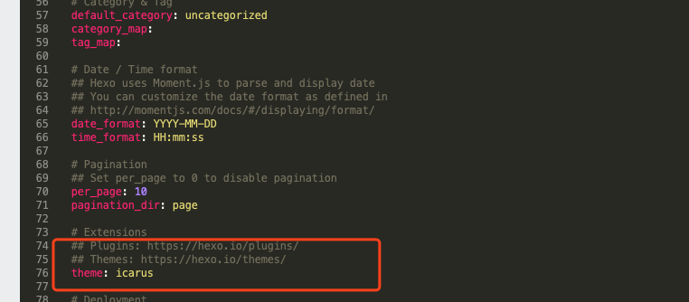

###简介

Hexo 是一款基于 Node.js 的静态博客框架。Hexo 使用 Markdown 解析文章，用户在本地安装Hexo并进行写作，通过一条命令，Hexo即可利用靓丽的主题自动生成静态网页。

<!--more-->

###安装

因自己使用的mac电脑，这里以mac安装发布为例，windows大体差不多。

1.1电脑本地创建一个文件夹，例如我这里的blog。


1.2 打开电脑终端执行以下命令：

```go
$npm install -g hexo-cli
$ hexo init
```

如果npm指令出现此报错zsh: command not found: node,需安装nodejs环境,[下载链接](https://nodejs.org/en/)

1.3 安装完成后，指定文件夹的目录如下

>├── _config.yml
>├── package.json
>├── scaffolds
>├── source
>|   ├── _drafts
>|   └── _posts
>└── themes

其中_config.yml文件用于存放网站的配置信息，你可以在此配置大部分的参数；scaffolds是存放模板的文件夹，当新建文章时，Hexo会根据scaffold来建立文件；source是资源文件夹，用于存放用户资源，themes是主题文件夹，存放博客主题，Hexo 会根据主题来生成静态页面。

1.4生成静态博客，在终端执行命令：

```
hexo s
```

Hexo将source文件夹中的Markdown 和 HTML 文件会被解析并放到public文件夹中，public文件夹用于存放静态博客文件，相当于网站根目录。
至此博客雏形基本完成，在浏览器中访问[http://localhost:4000/](http://localhost:4000/)，如图所示：


2.1主题更换 前往[主题页](https://hexo.io/themes/)，选择喜欢的主题：


2.2 挑选喜欢的主题后，将主题clone到blog的themes文件夹下

```
git clone https://github.com/ppoffice/hexo-theme-icarus.git themes/icarus
```

2.3 修改_config.yml中对应的主题字段为你选择的主题名



到此主题更换成功，可以本地hexo s本地看看是否替换成功。


3.1发布到github

可以参看这篇文章：[怎么把Hexo的博客托管到Git上](https://www.jianshu.com/p/4f3e1b6d1ca5)


4.常用hexo命令

```
hexo new "postName" #新建文章
hexo new page "pageName" #新建页面
hexo generate #生成静态页面至public目录
hexo server #开启预览访问端口（默认端口4000，'ctrl + c'关闭server）
hexo deploy #部署到GitHub
hexo help  # 查看帮助
hexo version  #查看Hexo的版本
```

指令缩写

```
hexo n == hexo new
hexo g == hexo generate
hexo s == hexo server
hexo d == hexo deploy
```

组合命令

```
hexo s -g #生成并本地预览
hexo d -g #生成并上传
```


5.[Hexo博客多端同步解决办法](https://segmentfault.com/a/1190000019459014?utm_source=tag-newest)

6.[自定义域名绑定篇](https://juejin.cn/post/6998140713334472740)