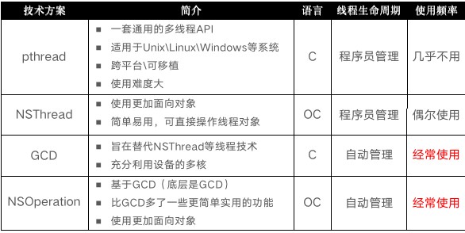
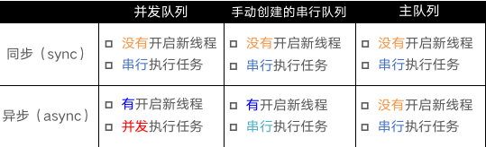

### 一 常见多线程方案

### 

<!--more-->

### 二 GCD

**2.1 基础术语**

同步和异步主要影响:能不能开启新的线程

**同步:**在当前线程中执行任务,不具备开启新线程的能力

**异步:**在新线程中执行任务,具备开启新线程的能力


并发和串行的主要影响:任务的执行方式

**并发:**多个任务并发(同时)执行

**串行:**一个任务执行完毕后,在执行下一个任务



**产生死锁:**使用sync函数往当前串行队列中添加任务，会卡住当前的串行队列 


**2.2常见使用**

**2.2.1任务+队列**

```objectivec
/**
 * 同步执行 + 并发队列
 * 特点：在当前线程中执行任务，不会开启新线程，执行完一个任务，再执行下一个任务。
 */
- (void)syncConCurrent{
    NSLog(@"currentThread---%@",[NSThread currentThread]);  // 打印当前线程
    NSLog(@"syncConcurrent---begin");
    
    dispatch_queue_t queue = dispatch_queue_create("com.hs.queue", DISPATCH_QUEUE_CONCURRENT);
    dispatch_sync(queue, ^{
        for (int i = 0; i < 2; i++) {
            [NSThread sleepForTimeInterval:2];
            NSLog(@"1---%@",[NSThread currentThread]);
        }
    });
    
    dispatch_sync(queue, ^{
        for (int i = 0; i < 2; i++) {
            [NSThread sleepForTimeInterval:2];
            NSLog(@"2---%@",[NSThread currentThread]);
        }
    });
    
    dispatch_sync(queue, ^{
        for (int i = 0; i < 2; i++) {
            [NSThread sleepForTimeInterval:2];
            NSLog(@"3---%@",[NSThread currentThread]);
        }
    });
}

输出结果:
2021-02-19 17:36:25.088970+0800 GCD01[2847:134875] currentThread---<NSThread: 0x6000035b0700>{number = 1, name = main}
2021-02-19 17:36:25.089089+0800 GCD01[2847:134875] syncConcurrent---begin
2021-02-19 17:36:27.090291+0800 GCD01[2847:134875] 1---<NSThread: 0x6000035b0700>{number = 1, name = main}
2021-02-19 17:36:29.090881+0800 GCD01[2847:134875] 1---<NSThread: 0x6000035b0700>{number = 1, name = main}
2021-02-19 17:36:31.091210+0800 GCD01[2847:134875] 2---<NSThread: 0x6000035b0700>{number = 1, name = main}
2021-02-19 17:36:33.092106+0800 GCD01[2847:134875] 2---<NSThread: 0x6000035b0700>{number = 1, name = main}
2021-02-19 17:36:35.093407+0800 GCD01[2847:134875] 3---<NSThread: 0x6000035b0700>{number = 1, name = main}
2021-02-19 17:36:37.093798+0800 GCD01[2847:134875] 3---<NSThread: 0x6000035b0700>{number = 1, name = main}


/**
 * 异步执行 + 并发队列
 * 特点：可以开启多个线程，任务交替（同时）执行。
 */
- (void)asyncConcurrent{
    NSLog(@"currentThread---%@",[NSThread currentThread]);  // 打印当前线程
    NSLog(@"asyncConcurrent---begin");
    
    dispatch_queue_t queue = dispatch_queue_create("com.hs.queue", DISPATCH_QUEUE_CONCURRENT);
    dispatch_async(queue, ^{
        for (int i = 0; i < 2; i++) {
            [NSThread sleepForTimeInterval:2];
            NSLog(@"1---%@",[NSThread currentThread]);
        }
    });
    
    dispatch_async(queue, ^{
        for (int i = 0; i < 2; i++) {
            [NSThread sleepForTimeInterval:2];
            NSLog(@"2---%@",[NSThread currentThread]);
        }
    });
    
    dispatch_async(queue, ^{
        for (int i = 0; i < 2; i++) {
            [NSThread sleepForTimeInterval:2];
            NSLog(@"3---%@",[NSThread currentThread]);
        }
    });
    
    NSLog(@"asyncConcurrent---end");
}

输出结果:
2021-02-19 17:43:09.998795+0800 GCD01[2932:138556] currentThread---<NSThread: 0x600000ffc740>{number = 1, name = main}
2021-02-19 17:43:09.998905+0800 GCD01[2932:138556] asyncConcurrent---begin
2021-02-19 17:43:09.999027+0800 GCD01[2932:138556] asyncConcurrent---end
2021-02-19 17:43:12.004240+0800 GCD01[2932:138746] 1---<NSThread: 0x600000fda9c0>{number = 8, name = (null)}
2021-02-19 17:43:12.004239+0800 GCD01[2932:138757] 2---<NSThread: 0x600000ff25c0>{number = 7, name = (null)}
2021-02-19 17:43:12.004241+0800 GCD01[2932:138747] 3---<NSThread: 0x600000fbc8c0>{number = 5, name = (null)}
2021-02-19 17:43:14.004538+0800 GCD01[2932:138746] 1---<NSThread: 0x600000fda9c0>{number = 8, name = (null)}
2021-02-19 17:43:14.004538+0800 GCD01[2932:138757] 2---<NSThread: 0x600000ff25c0>{number = 7, name = (null)}
2021-02-19 17:43:14.004538+0800 GCD01[2932:138747] 3---<NSThread: 0x600000fbc8c0>{number = 5, name = (null)}

/**
 * 同步执行 + 串行队列
 * 特点：不会开启新线程，在当前线程执行任务。任务是串行的，执行完一个任务，再执行下一个任务。
 */
- (void)syncSerial{
    NSLog(@"currentThread---%@",[NSThread currentThread]);  // 打印当前线程
    NSLog(@"syncSerial---begin");
    
    dispatch_queue_t queue = dispatch_queue_create("com.hs.queue", DISPATCH_QUEUE_SERIAL);
    dispatch_sync(queue, ^{
        for (int i = 0; i < 2; i++) {
            [NSThread sleepForTimeInterval:2];
            NSLog(@"1---%@",[NSThread currentThread]);
        }
    });
    
    dispatch_sync(queue, ^{
        for (int i = 0; i < 2; i++) {
            [NSThread sleepForTimeInterval:2];
            NSLog(@"2---%@",[NSThread currentThread]);
        }
    });
    
    dispatch_sync(queue, ^{
        for (int i = 0; i < 2; i++) {
            [NSThread sleepForTimeInterval:2];
            NSLog(@"3---%@",[NSThread currentThread]);
        }
    });
    
    NSLog(@"syncSerial---end");
}

输出结果:
2021-02-19 17:46:09.812435+0800 GCD01[2986:140787] currentThread---<NSThread: 0x6000027003c0>{number = 1, name = main}
2021-02-19 17:46:09.812540+0800 GCD01[2986:140787] syncSerial---begin
2021-02-19 17:46:11.812918+0800 GCD01[2986:140787] 1---<NSThread: 0x6000027003c0>{number = 1, name = main}
2021-02-19 17:46:13.813264+0800 GCD01[2986:140787] 1---<NSThread: 0x6000027003c0>{number = 1, name = main}
2021-02-19 17:46:15.814544+0800 GCD01[2986:140787] 2---<NSThread: 0x6000027003c0>{number = 1, name = main}
2021-02-19 17:46:17.814767+0800 GCD01[2986:140787] 2---<NSThread: 0x6000027003c0>{number = 1, name = main}
2021-02-19 17:46:19.815968+0800 GCD01[2986:140787] 3---<NSThread: 0x6000027003c0>{number = 1, name = main}
2021-02-19 17:46:21.816267+0800 GCD01[2986:140787] 3---<NSThread: 0x6000027003c0>{number = 1, name = main}
2021-02-19 17:46:21.816439+0800 GCD01[2986:140787] syncSerial---end

/**
 * 异步执行 + 串行队列
 * 特点：会开启一条新线程，但是因为任务是串行的，执行完一个任务，再执行下一个任务。
 */
- (void)asyncSerial{
    NSLog(@"currentThread---%@",[NSThread currentThread]);  // 打印当前线程
    NSLog(@"asyncSerial---begin");
    
    dispatch_queue_t queue = dispatch_queue_create("com.hs.queue", DISPATCH_QUEUE_SERIAL);
    dispatch_async(queue, ^{
        for (int i = 0; i < 2; i++) {
            [NSThread sleepForTimeInterval:2];
            NSLog(@"1---%@",[NSThread currentThread]);
        }
    });
    
    dispatch_async(queue, ^{
        for (int i = 0; i < 2; i++) {
            [NSThread sleepForTimeInterval:2];
            NSLog(@"2---%@",[NSThread currentThread]);
        }
    });
    
    dispatch_async(queue, ^{
        for (int i = 0; i < 2; i++) {
            [NSThread sleepForTimeInterval:2];
            NSLog(@"3---%@",[NSThread currentThread]);
        }
    });
    
    NSLog(@"asyncSerial---end");
}

输出结果:
2021-02-19 17:48:48.440422+0800 GCD01[3023:142364] currentThread---<NSThread: 0x6000021843c0>{number = 1, name = main}
2021-02-19 17:48:48.440607+0800 GCD01[3023:142364] asyncSerial---begin
2021-02-19 17:48:48.440731+0800 GCD01[3023:142364] asyncSerial---end
2021-02-19 17:48:50.445911+0800 GCD01[3023:142419] 1---<NSThread: 0x600002199d00>{number = 6, name = (null)}
2021-02-19 17:48:52.451231+0800 GCD01[3023:142419] 1---<NSThread: 0x600002199d00>{number = 6, name = (null)}
2021-02-19 17:48:54.455630+0800 GCD01[3023:142419] 2---<NSThread: 0x600002199d00>{number = 6, name = (null)}
2021-02-19 17:48:56.455855+0800 GCD01[3023:142419] 2---<NSThread: 0x600002199d00>{number = 6, name = (null)}
2021-02-19 17:48:58.461050+0800 GCD01[3023:142419] 3---<NSThread: 0x600002199d00>{number = 6, name = (null)}
2021-02-19 17:49:00.463611+0800 GCD01[3023:142419] 3---<NSThread: 0x600002199d00>{number = 6, name = (null)}

/**
* 同步执行 + 主队列
* 特点(主线程调用)：互相等待,卡住主线程,造成死锁
*/
- (void)syncMain{
    NSLog(@"currentThread---%@",[NSThread currentThread]);  // 打印当前线程
    NSLog(@"syncMain---begin");
    
    dispatch_queue_t queue = dispatch_get_main_queue();
    dispatch_sync(queue, ^{
        for (int i = 0; i < 2; i++) {
            [NSThread sleepForTimeInterval:2];
            NSLog(@"1---%@",[NSThread currentThread]);
        }
    });
    
    dispatch_sync(queue, ^{
        for (int i = 0; i < 2; i++) {
            [NSThread sleepForTimeInterval:2];
            NSLog(@"2---%@",[NSThread currentThread]);
        }
    });
    
    dispatch_sync(queue, ^{
        for (int i = 0; i < 2; i++) {
            [NSThread sleepForTimeInterval:2];
            NSLog(@"3---%@",[NSThread currentThread]);
        }
    });
    
    NSLog(@"syncMain---end");
}

输出结果:
2021-02-19 17:51:57.239288+0800 GCD01[3047:144140] currentThread---<NSThread: 0x600003c549c0>{number = 1, name = main}
2021-02-19 17:51:57.239399+0800 GCD01[3047:144140] syncMain---begin
(lldb) 

/**
 * 异步执行 + 主队列
 * 特点：只在主线程中执行任务，执行完一个任务，再执行下一个任务
 */
- (void)asyncMain{
    NSLog(@"currentThread---%@",[NSThread currentThread]);  // 打印当前线程
    NSLog(@"asyncMain---begin");
    
    dispatch_queue_t queue = dispatch_get_main_queue();
    dispatch_async(queue, ^{
        for (int i = 0; i < 2; i++) {
            [NSThread sleepForTimeInterval:2];
            NSLog(@"1---%@",[NSThread currentThread]);
        }
    });
    
    dispatch_async(queue, ^{
        for (int i = 0; i < 2; i++) {
            [NSThread sleepForTimeInterval:2];
            NSLog(@"2---%@",[NSThread currentThread]);
        }
    });
    
    dispatch_async(queue, ^{
        for (int i = 0; i < 2; i++) {
            [NSThread sleepForTimeInterval:2];
            NSLog(@"3---%@",[NSThread currentThread]);
        }
    });
    
    NSLog(@"asyncMain---end");
}

输出结果:
2021-02-19 17:57:06.334474+0800 GCD01[3100:147296] currentThread---<NSThread: 0x6000021f4080>{number = 1, name = main}
2021-02-19 17:57:06.334603+0800 GCD01[3100:147296] asyncMain---begin
2021-02-19 17:57:06.334717+0800 GCD01[3100:147296] asyncMain---end
2021-02-19 17:57:08.351357+0800 GCD01[3100:147296] 1---<NSThread: 0x6000021f4080>{number = 1, name = main}
2021-02-19 17:57:10.351767+0800 GCD01[3100:147296] 1---<NSThread: 0x6000021f4080>{number = 1, name = main}
2021-02-19 17:57:12.352891+0800 GCD01[3100:147296] 2---<NSThread: 0x6000021f4080>{number = 1, name = main}
2021-02-19 17:57:14.353229+0800 GCD01[3100:147296] 2---<NSThread: 0x6000021f4080>{number = 1, name = main}
2021-02-19 17:57:16.354593+0800 GCD01[3100:147296] 3---<NSThread: 0x6000021f4080>{number = 1, name = main}
2021-02-19 17:57:18.354813+0800 GCD01[3100:147296] 3---<NSThread: 0x6000021f4080>{number = 1, name = main}
```

**2.2.2****队列组dispatch_group**

```objectivec
/**
 * 队列组 dispatch_group_notify
 *当所有任务都执行完成之后，才执行dispatch_group_notify block 中的任务
 */
- (void)qpc_dispatchgroup{
    NSLog(@"currentThread---%@",[NSThread currentThread]);
    NSLog(@"group---begin");
    dispatch_group_t group = dispatch_group_create();
    dispatch_queue_t queue = dispatch_queue_create("myqueue", DISPATCH_QUEUE_CONCURRENT);
    dispatch_group_async(group, queue, ^{
        for (int i = 0; i < 2; i++) {
            [NSThread sleepForTimeInterval:2];
            NSLog(@"1---%@",[NSThread currentThread]);
        }
    });
    dispatch_group_async(group, queue, ^{
        for (int i = 0; i < 2; i++) {
            [NSThread sleepForTimeInterval:2];
            NSLog(@"2---%@",[NSThread currentThread]);
        }
    });
    dispatch_group_notify(group, dispatch_get_main_queue(), ^{
        for (int i = 0; i < 2; i++) {
            [NSThread sleepForTimeInterval:2];
            NSLog(@"3---%@",[NSThread currentThread]);
        }
    });
    
    NSLog(@"group---end");
}

输出结果:
2021-02-19 18:02:46.858071+0800 GCD01[3146:150155] currentThread---<NSThread: 0x6000037681c0>{number = 1, name = main}
2021-02-19 18:02:46.858216+0800 GCD01[3146:150155] group---begin
2021-02-19 18:02:46.858329+0800 GCD01[3146:150155] group---end
2021-02-19 18:02:48.862878+0800 GCD01[3146:150280] 1---<NSThread: 0x60000372d6c0>{number = 7, name = (null)}
2021-02-19 18:02:48.862876+0800 GCD01[3146:150281] 2---<NSThread: 0x60000372c640>{number = 3, name = (null)}
2021-02-19 18:02:50.864822+0800 GCD01[3146:150280] 1---<NSThread: 0x60000372d6c0>{number = 7, name = (null)}
2021-02-19 18:02:50.864823+0800 GCD01[3146:150281] 2---<NSThread: 0x60000372c640>{number = 3, name = (null)}
2021-02-19 18:02:52.865242+0800 GCD01[3146:150155] 3---<NSThread: 0x6000037681c0>{number = 1, name = main}
2021-02-19 18:02:54.865686+0800 GCD01[3146:150155] 3---<NSThread: 0x6000037681c0>{number = 1, name = main}

/**
 * 队列组 dispatch_group_wait
 *当所有任务执行完成之后，才执行 dispatch_group_wait 之后的操作,会阻塞当前线程
 */
- (void)groupWait{
    NSLog(@"currentThread---%@",[NSThread currentThread]);
    NSLog(@"group---begin");
    dispatch_group_t group = dispatch_group_create();
    dispatch_queue_t queue = dispatch_queue_create("myqueue", DISPATCH_QUEUE_CONCURRENT);
    dispatch_group_async(group, queue, ^{
        for (int i = 0; i < 2; i++) {
            [NSThread sleepForTimeInterval:2];
            NSLog(@"1---%@",[NSThread currentThread]);
        }
    });
    dispatch_group_async(group, queue, ^{
        for (int i = 0; i < 2; i++) {
            [NSThread sleepForTimeInterval:2];
            NSLog(@"2---%@",[NSThread currentThread]);
        }
    });

    dispatch_group_wait(group, DISPATCH_TIME_FOREVER);
    
    NSLog(@"group---end");
}

输出结果:
2021-02-19 18:09:41.868091+0800 GCD01[3187:153758] currentThread---<NSThread: 0x6000030e4140>{number = 1, name = main}
2021-02-19 18:09:41.868220+0800 GCD01[3187:153758] group---begin
2021-02-19 18:09:43.873508+0800 GCD01[3187:153883] 2---<NSThread: 0x6000030de980>{number = 6, name = (null)}
2021-02-19 18:09:43.873508+0800 GCD01[3187:153881] 1---<NSThread: 0x6000030d7a80>{number = 7, name = (null)}
2021-02-19 18:09:45.875594+0800 GCD01[3187:153881] 1---<NSThread: 0x6000030d7a80>{number = 7, name = (null)}
2021-02-19 18:09:45.875594+0800 GCD01[3187:153883] 2---<NSThread: 0x6000030de980>{number = 6, name = (null)}
2021-02-19 18:09:45.875811+0800 GCD01[3187:153758] group---end

/**
 * 队列组 dispatch_group_enter、dispatch_group_leave
 *当所有任务执行完成之后，才执行 dispatch_group_notify 中的任务。这里的dispatch_group_enter、dispatch_group_leave组合，其实等同于dispatch_group_async
 */
- (void)groupEnterAndLeave{
    NSLog(@"currentThread---%@",[NSThread currentThread]);
    NSLog(@"group---begin");
    
    dispatch_group_t group = dispatch_group_create();
    dispatch_queue_t queue = dispatch_get_global_queue(DISPATCH_QUEUE_PRIORITY_DEFAULT, 0);
    dispatch_group_enter(group);
    dispatch_async(queue, ^{
        for (int i = 0; i < 2; ++i) {
            [NSThread sleepForTimeInterval:2];
            NSLog(@"1---%@",[NSThread currentThread]);
        }
        dispatch_group_leave(group);
    });
    
    dispatch_group_enter(group);
    dispatch_async(queue, ^{
        for (int i = 0; i < 2; ++i) {
            [NSThread sleepForTimeInterval:2];
            NSLog(@"2---%@",[NSThread currentThread]);
        }
        dispatch_group_leave(group);
    });
    
    dispatch_group_notify(group, dispatch_get_main_queue(), ^{
        // 等前面的异步操作都执行完毕后，回到主线程.
        for (int i = 0; i < 2; ++i) {
            [NSThread sleepForTimeInterval:2];
            NSLog(@"3---%@",[NSThread currentThread]);
        }
    });
    
    NSLog(@"group---end");
}

输出结果:
2021-02-19 18:17:13.875926+0800 GCD01[3252:157677] currentThread---<NSThread: 0x600000e807c0>{number = 1, name = main}
2021-02-19 18:17:13.876043+0800 GCD01[3252:157677] group---begin
2021-02-19 18:17:13.876179+0800 GCD01[3252:157677] group---end
2021-02-19 18:17:15.876440+0800 GCD01[3252:157767] 2---<NSThread: 0x600000ec5740>{number = 7, name = (null)}
2021-02-19 18:17:15.876486+0800 GCD01[3252:157765] 1---<NSThread: 0x600000ec8600>{number = 8, name = (null)}
2021-02-19 18:17:17.881362+0800 GCD01[3252:157767] 2---<NSThread: 0x600000ec5740>{number = 7, name = (null)}
2021-02-19 18:17:17.881362+0800 GCD01[3252:157765] 1---<NSThread: 0x600000ec8600>{number = 8, name = (null)}
2021-02-19 18:17:19.882660+0800 GCD01[3252:157677] 3---<NSThread: 0x600000e807c0>{number = 1, name = main}
2021-02-19 18:17:21.883995+0800 GCD01[3252:157677] 3---<NSThread: 0x600000e807c0>{number = 1, name = main}
```


**2.2.3****dispatch_barrier_async 栅栏方法**

```objectivec
/**
 * 栅栏方法 dispatch_barrier_async
 * 执行完栅栏前面的操作之后，才执行栅栏操作，最后再执行栅栏后边的操作
 */
- (void)barrier{
    dispatch_queue_t queue = dispatch_queue_create("com.hs.dome", DISPATCH_QUEUE_CONCURRENT);
    dispatch_async(queue, ^{
        for (int i = 0; i < 2; ++i) {
            [NSThread sleepForTimeInterval:2];
            NSLog(@"1---%@",[NSThread currentThread]);
        }
    });
    dispatch_async(queue, ^{
        for (int i = 0; i < 2; ++i) {
            [NSThread sleepForTimeInterval:2];
            NSLog(@"2---%@",[NSThread currentThread]);
        }
    });
    
    dispatch_barrier_async(queue, ^{
        for (int i = 0; i < 2; ++i) {
            [NSThread sleepForTimeInterval:2];
            NSLog(@"barrier---%@",[NSThread currentThread]);
        }
    });
    
    dispatch_async(queue, ^{
        for (int i = 0; i < 2; ++i) {
            [NSThread sleepForTimeInterval:2];
            NSLog(@"3---%@",[NSThread currentThread]);
        }
    });
    
    dispatch_async(queue, ^{
        for (int i = 0; i < 2; ++i) {
            [NSThread sleepForTimeInterval:2];
            NSLog(@"4---%@",[NSThread currentThread]);
        }
    });
}
```

**2.2.4****dispatch_semaphore 信号量**

```objectivec
/**
 * semaphore 线程同步
 * 将异步执行任务转换为同步执行任务
 */
- (void)semaphoreSync{
    NSLog(@"currentThread---%@",[NSThread currentThread]);
    NSLog(@"semaphore---begin");
    dispatch_queue_t queue = dispatch_get_global_queue(DISPATCH_QUEUE_PRIORITY_DEFAULT, 0);
    dispatch_semaphore_t semaphore = dispatch_semaphore_create(0);
    __block int number = 0;
    dispatch_async(queue, ^{
        [NSThread sleepForTimeInterval:2];
        NSLog(@"1---%@",[NSThread currentThread]);
        
        number = 100;
        dispatch_semaphore_signal(semaphore);
    });
    
    dispatch_semaphore_wait(semaphore, DISPATCH_TIME_FOREVER);
    NSLog(@"semaphore---end,number = %d",number);
}
```

### 三 NSOperation

**3.1.1 NSOperation、NSOperationQueue 使用步骤**

```objectivec
/**
 * 使用 addOperationWithBlock: 将操作加入到操作队列中
 * 将操作加入到操作队列后能够开启新线程，进行并发执行
 */
- (void)addOperationWithBlockToQueue{
    NSOperationQueue *queue = [[NSOperationQueue alloc] init];
    [queue addOperationWithBlock:^{
        for (int i = 0; i < 2; i++) {
            [NSThread sleepForTimeInterval:2];
            NSLog(@"1---%@", [NSThread currentThread]);
        }
    }];
    [queue addOperationWithBlock:^{
        for (int i = 0; i < 2; i++) {
            [NSThread sleepForTimeInterval:2];
            NSLog(@"2---%@", [NSThread currentThread]);
        }
    }];
    [queue addOperationWithBlock:^{
        for (int i = 0; i < 2; i++) {
            [NSThread sleepForTimeInterval:2];
            NSLog(@"3---%@", [NSThread currentThread]);
        }
    }];
    [queue addOperationWithBlock:^{
        for (int i = 0; i < 2; i++) {
            [NSThread sleepForTimeInterval:2];
            NSLog(@"4---%@", [NSThread currentThread]);
        }
    }];
}
```

**3.1.2** **控制串行执行、并发执行**

maxConcurrentOperationCount 控制的不是并发线程的数量，而是一个队列中同时能并发执行的最大操作数

- maxConcurrentOperationCount 默认情况下为-1，表示不进行限制，可进行并发执行。
- maxConcurrentOperationCount 为1时，队列为串行队列。只能串行执行。
- maxConcurrentOperationCount 大于1时，队列为并发队列。操作并发执行，当然这个值不应超过系统限制

```objectivec
/**
 * 设置 MaxConcurrentOperationCount（最大并发操作数）
 */
- (void)addOperationWithBlockToQueue{
    NSOperationQueue *queue = [[NSOperationQueue alloc] init];
    queue.maxConcurrentOperationCount = 1;//串行执行
    [queue addOperationWithBlock:^{
        for (int i = 0; i < 2; i++) {
            [NSThread sleepForTimeInterval:2];
            NSLog(@"1---%@", [NSThread currentThread]);
        }
    }];
    [queue addOperationWithBlock:^{
        for (int i = 0; i < 2; i++) {
            [NSThread sleepForTimeInterval:2];
            NSLog(@"2---%@", [NSThread currentThread]);
        }
    }];
    [queue addOperationWithBlock:^{
        for (int i = 0; i < 2; i++) {
            [NSThread sleepForTimeInterval:2];
            NSLog(@"3---%@", [NSThread currentThread]);
        }
    }];
    [queue addOperationWithBlock:^{
        for (int i = 0; i < 2; i++) {
            [NSThread sleepForTimeInterval:2];
            NSLog(@"4---%@", [NSThread currentThread]);
        }
    }];
}
```

**总结:**

当最大并发操作数为1时，操作是按顺序串行执行的，并且一个操作完成之后，下一个操作才开始执行。当最大操作并发数为2时，操作是并发执行的，可以同时执行两个操作。而开启线程数量是由系统决定的，不需要我们来管理。


**3.1.3** **addDependency操作依赖**

```objectivec
- (void)addDependency{
    NSOperationQueue *queue = [[NSOperationQueue alloc] init];
    NSBlockOperation *op1 = [NSBlockOperation blockOperationWithBlock:^{
        for (int i = 0; i < 2; i++) {
            [NSThread sleepForTimeInterval:2];
            NSLog(@"1---%@", [NSThread currentThread]);
        }
    }];
    NSBlockOperation *op2 = [NSBlockOperation blockOperationWithBlock:^{
        for (int i = 0; i < 2; i++) {
            [NSThread sleepForTimeInterval:2];
            NSLog(@"2---%@", [NSThread currentThread]);
        }
    }];
    [op2 addDependency:op1];// 让op2 依赖于 op1，则先执行op1，在执行op2
    [queue addOperation:op1];
    [queue addOperation:op2];
}
打印结果:
2021-02-20 15:21:40.251808+0800 GCD01[4133:192904] 1---<NSThread: 0x600003adad80>{number = 5, name = (null)}
2021-02-20 15:21:42.252554+0800 GCD01[4133:192904] 1---<NSThread: 0x600003adad80>{number = 5, name = (null)}
2021-02-20 15:21:44.257346+0800 GCD01[4133:192903] 2---<NSThread: 0x600003ad29c0>{number = 7, name = (null)}
2021-02-20 15:21:46.257638+0800 GCD01[4133:192903] 2---<NSThread: 0x600003ad29c0>{number = 7, name = (null)}
```

**3.1.4** **NSOperation 优先级**

```objectivec
// 优先级的取值
typedef NS_ENUM(NSInteger, NSOperationQueuePriority) {
    NSOperationQueuePriorityVeryLow = -8L,
    NSOperationQueuePriorityLow = -4L,
    NSOperationQueuePriorityNormal = 0,
    NSOperationQueuePriorityHigh = 4,
    NSOperationQueuePriorityVeryHigh = 8
};
```

设置优先级后并没有达到想要的效果,该属性还待解答.

```objectivec
- (void)addDependency_queuePriority{
    NSOperationQueue *queue = [[NSOperationQueue alloc] init];
    NSInvocationOperation *op1 = [[NSInvocationOperation alloc] initWithTarget:self selector:@selector(task1) object:nil];
    NSInvocationOperation *op2 = [[NSInvocationOperation alloc] initWithTarget:self selector:@selector(task2) object:nil];
    NSInvocationOperation *op3 = [[NSInvocationOperation alloc] initWithTarget:self selector:@selector(task3) object:nil];
    NSInvocationOperation *op4 = [[NSInvocationOperation alloc] initWithTarget:self selector:@selector(task4) object:nil];
    op4.queuePriority = NSOperationQueuePriorityVeryHigh;
    op1.queuePriority = NSOperationQueuePriorityLow;
    
    [queue addOperation:op1];
    [queue addOperation:op2];
    [queue addOperation:op3];
    [queue addOperation:op4];
}
打印结果:
2021-02-20 15:48:48.168577+0800 GCD01[4346:208620] 4---<NSThread: 0x6000004729c0>{number = 4, name = (null)}
2021-02-20 15:48:48.168580+0800 GCD01[4346:208625] 1---<NSThread: 0x600000466000>{number = 3, name = (null)}
2021-02-20 15:48:48.168581+0800 GCD01[4346:208622] 2---<NSThread: 0x600000457a40>{number = 5, name = (null)}
2021-02-20 15:48:48.168577+0800 GCD01[4346:208626] 3---<NSThread: 0x600000465880>{number = 8, name = (null)}
2021-02-20 15:48:50.173404+0800 GCD01[4346:208622] 2---<NSThread: 0x600000457a40>{number = 5, name = (null)}
2021-02-20 15:48:50.173404+0800 GCD01[4346:208626] 3---<NSThread: 0x600000465880>{number = 8, name = (null)}
2021-02-20 15:48:50.173404+0800 GCD01[4346:208625] 1---<NSThread: 0x600000466000>{number = 3, name = (null)}
2021-02-20 15:48:50.173404+0800 GCD01[4346:208620] 4---<NSThread: 0x6000004729c0>{number = 4, name = (null)}
```

**3.1.4** **NSOperation线程间通信**

```objectivec
/**
 * 线程间通信
 */
- (void)communication{
    NSOperationQueue *queue = [[NSOperationQueue alloc] init];
    [queue addOperationWithBlock:^{
        for (int i = 0; i < 2; i++) {
            [NSThread sleepForTimeInterval:2];
            NSLog(@"1---%@", [NSThread currentThread]);
        }
        //返回主线程
        [[NSOperationQueue mainQueue] addOperationWithBlock:^{
            for (int i = 0; i < 2; i++) {
                [NSThread sleepForTimeInterval:2];
                NSLog(@"2---%@", [NSThread currentThread]);
            }
        }];
    }];
}
```


### 四 多线程安全隐患-线程同步

常见的线程同步技术:加锁

iOS常见加锁方案

- OSSpinLock 
- os_unfair_lock 
- pthread_mutex 
- dispatch_semaphore 
- dispatch_queue(DISPATCH_QUEUE_SERIAL) 
- NSLock 
- NSRecursiveLock 
- NSCondition
- NSConditionLock 
- @synchronized 


**4.1** **OSSpinLock** 

OSSpinLock叫做”自旋锁”，等待锁的线程会处于忙等（busy-wait）状态，一直占用着CPU资源

目前已经不再安全，可能会出现优先级反转问题

如果等待锁的线程优先级较高，它会一直占用着CPU资源，优先级低的线程就无法释放锁

需要导入头文件#import <libkern/OSAtomic.h>


**4.2** **os_unfair_lock** 

os_unfair_lock用于取代不安全的OSSpinLock ，从iOS10开始才支持

从底层调用看，等待os_unfair_lock锁的线程会处于休眠状态，并非忙等

需要导入头文件#import <os/lock.h>


**4.3** **pthread_mutex (normal)**

mutex叫做”互斥锁”，等待锁的线程会处于休眠状态

需要导入头文件#import <pthread.h>


**4.4** **pthread_mutex (recursive) 递归锁**


**4.5** **pthread_mutex (condition) 条件**


**4.6 NSLock/NSRecursiveLock**

NSLock是对mutex普通锁的封装 

NSRecursiveLock也是对mutex递归锁的封装，API跟NSLock基本一致


**4.7 NSCondition**

NSCondition是对mutex和cond的封装 


**4.8** **NSConditionLock**

NSConditionLock是对NSCondition的进一步封装，可以设置具体的条件值 


**4.9 dispatch_semaphore**

semaphore叫做”信号量” 

信号量的初始值，可以用来控制线程并发访问的最大数量 

信号量的初始值为1，代表同时只允许1条线程访问资源，保证线程同步 


**4.10 GCD串行队列**


**4.11 @synchronized** 

@synchronized是对mutex递归锁的封装 

@synchronized(obj)内部会生成obj对应的递归锁，然后进行加锁、解锁操作


**4.2 线程同步性能比较**

性能从高到低排序 

1. os_unfair_lock 
2. OSSpinLock 
3. dispatch_semaphore 
4. pthread_mutex 
5. dispatch_queue(DISPATCH_QUEUE_SERIAL) 
6. NSLock 
7. NSCondition 
8. pthread_mutex(recursive) 
9. NSRecursiveLock 
10. NSConditionLock 
11. @synchronized


### 五 读写方案 (多读单写)

- 同一时间，只能有1个线程进行写的操作
- 同一时间，允许多个线程进行读的操作
- 同一时间，不允许既有写的操作，又有读的操作

现有解决方案:

1. pthread_rwlock：读写锁
2. dispatch_barrier_async：异步栅栏调用

```objectivec
- (void)viewDidLoad {
    [super viewDidLoad];

    pthread_rwlock_init(&_lock, NULL);
    dispatch_queue_t queue = dispatch_get_global_queue(0, 0);
    for (int i = 0; i < 10; i++) {
        dispatch_async(queue, ^{
            [self read];
        });
        
        dispatch_async(queue, ^{
            [self write];
        });
    }
}

- (void)read{
    pthread_rwlock_rdlock(&_lock);
    sleep(1);
    NSLog(@"%s",__func__);
    pthread_rwlock_unlock(&_lock);
}

- (void)write{
    pthread_rwlock_wrlock(&_lock);
    sleep(1);
    NSLog(@"%s",__func__);
    pthread_rwlock_unlock(&_lock);
}

// pthread_rwlock_destroy 是pthread锁，要销毁
- (void)dealloc{
    pthread_rwlock_destroy(&_lock);
}

打印结果:
2021-02-20 16:31:56.110128+0800 GCD01[4628:232022] -[ViewController read]
2021-02-20 16:31:56.110128+0800 GCD01[4628:232025] -[ViewController read]
2021-02-20 16:31:57.115415+0800 GCD01[4628:232023] -[ViewController write]
2021-02-20 16:31:58.117225+0800 GCD01[4628:232024] -[ViewController write]
2021-02-20 16:31:59.119190+0800 GCD01[4628:232026] -[ViewController read]
2021-02-20 16:32:00.121009+0800 GCD01[4628:232028] -[ViewController write]
2021-02-20 16:32:01.123432+0800 GCD01[4628:232030] -[ViewController read]
2021-02-20 16:32:02.127358+0800 GCD01[4628:232031] -[ViewController write]
2021-02-20 16:32:03.130017+0800 GCD01[4628:232032] -[ViewController read]
2021-02-20 16:32:04.133641+0800 GCD01[4628:232033] -[ViewController write]
2021-02-20 16:32:05.134574+0800 GCD01[4628:232034] -[ViewController read]
2021-02-20 16:32:06.136287+0800 GCD01[4628:232035] -[ViewController write]
2021-02-20 16:32:07.139924+0800 GCD01[4628:232036] -[ViewController read]
2021-02-20 16:32:08.144879+0800 GCD01[4628:232037] -[ViewController write]
2021-02-20 16:32:09.150167+0800 GCD01[4628:232038] -[ViewController read]
2021-02-20 16:32:10.153798+0800 GCD01[4628:232039] -[ViewController write]
2021-02-20 16:32:11.158837+0800 GCD01[4628:232040] -[ViewController read]
2021-02-20 16:32:12.161323+0800 GCD01[4628:232041] -[ViewController write]
2021-02-20 16:32:13.165552+0800 GCD01[4628:232042] -[ViewController read]
2021-02-20 16:32:14.169961+0800 GCD01[4628:232043] -[ViewController write]
- (void)viewDidLoad {
    [super viewDidLoad];
    
    self.queue = dispatch_queue_create("rw_queue", DISPATCH_QUEUE_CONCURRENT);
    for (int i = 0; i < 10; i++) {
        dispatch_async(_queue, ^{
            [self read];
        });
        dispatch_async(_queue, ^{
            [self read];
        });
        dispatch_async(_queue, ^{
            [self read];
        });
        dispatch_barrier_sync(self.queue, ^{
            [self write];
        });
    }
}

- (void)read{
    sleep(1);
    NSLog(@"%s",__func__);
}

- (void)write{
    sleep(1);
    NSLog(@"%s",__func__);
}
```
