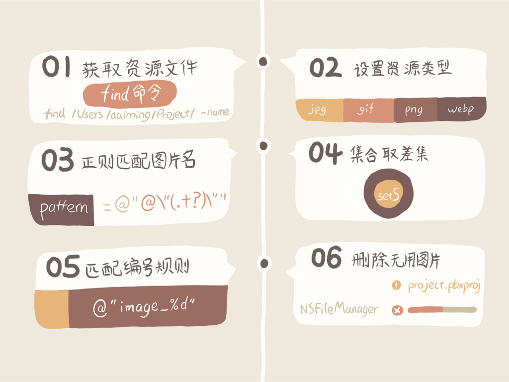
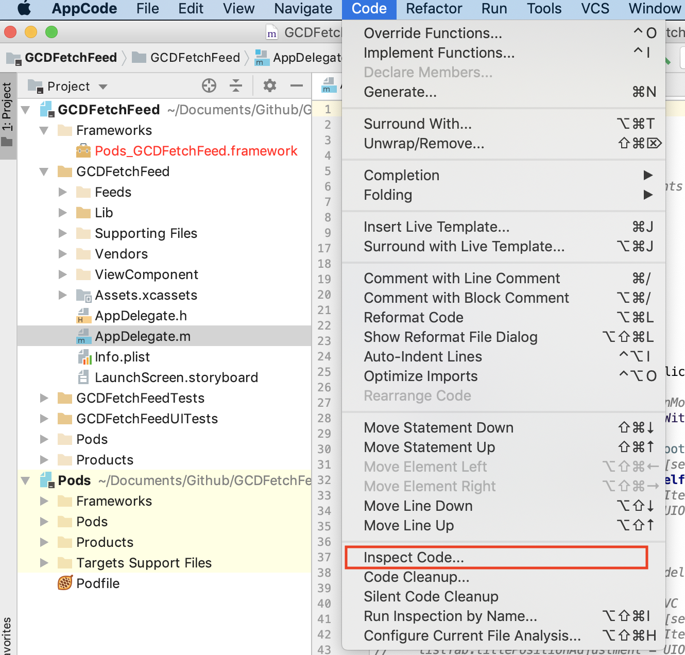
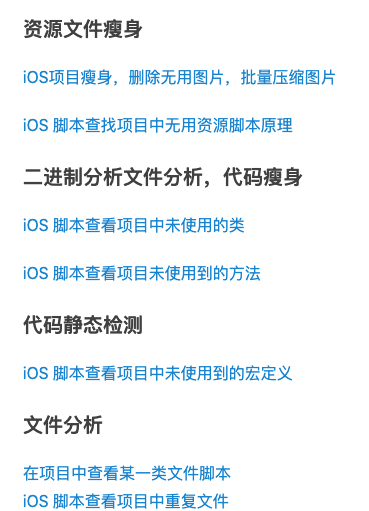
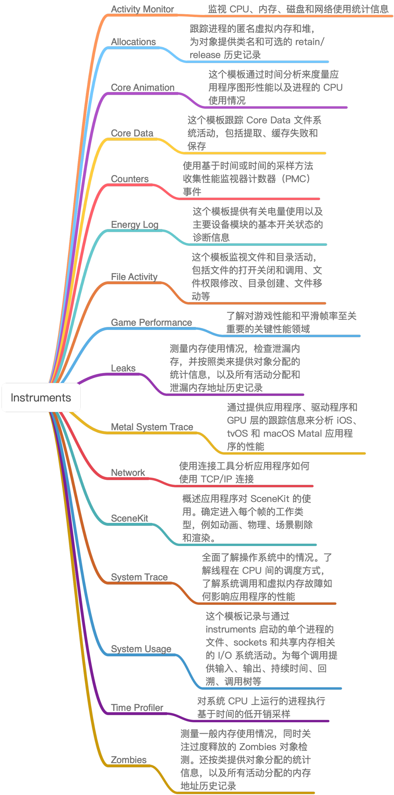
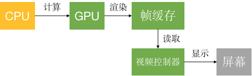
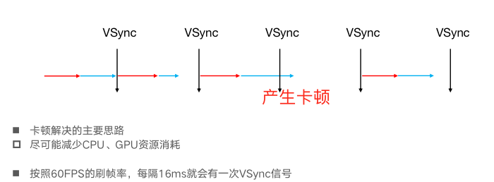
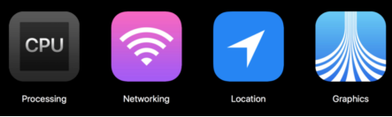

## 一、静态分析

Xcode 自带的静态分析工具 Analyze，通过静态语法分析能够找出在代码层面就能发现的内存泄露问题，还可以通过上下文分析出是否存在变量无用等问题。但是，Analyze 的功能还是有限，还是无法帮助我们在编写代码的阶段发现更多的问题。所以，这才诞生出了功能更全、定制化高、效率高的第三方静态检查工具。比如OCLint、Infer等

Analyze分析参考文章： [Analyze静态分析](https://www.jianshu.com/p/edd344e95dc1?utm_campaign=maleskine&utm_content=note&utm_medium=seo_notes&utm_source=recommendation)

Infer静态分析工具使用： https://www.cnblogs.com/ZachRobin/p/11280499.html

<!--more-->

## 二、包大小瘦身

#### 2.1删除无用资源

**图片资源优化**

1.删除无用图片

使用插件：https://github.com/tinymind/LSUnusedResources

2.图片资源压缩

部分图片采用webp格式

图片压缩工具：https://tinypng.com/

#### 2.2代码瘦身

- 感谢踩坑小分队提供的瘦身py脚本系列工具集：https://www.jianshu.com/p/bde52cc0b5d5
- 如果工程量不是很大的话，可以使用 AppCode 来做分析，用 AppCode 做分析的方法很简单，直接在 AppCode 里选择 Code->Inspect Code 就可以进行静态分析。

**
**

无用类查找

python FindClassUnRefs.py -p /Users/pengchengqin/Library/Developer/Xcode/DerivedData/***-fdgdsseeslsaryblrnxopmyfmdwl/Build/Products/Debug-iphoneos/***.app -b Pod,AF,SD,BM,MJ,JX,FM,IQ

## 三、线下性能分析工具Instruments

****

## 四、app崩溃日志信息监控

代码线上埋点分析：bugly (https://bugly.qq.com/)

## 五、卡顿原因及优化

在屏幕成像的过程中，CPU和GPU起着至关重要的作用 

CPU（Central Processing Unit，中央处理器） 

对象的创建和销毁、对象属性的调整、布局计算、文本的计算和排版、图片的格式转换和解码、图像的绘制（Core Graphics） 

GPU（Graphics Processing Unit，图形处理器） 

纹理的渲染 

**卡顿原因**

**卡顿优化（CPU方面）**

- 尽量用轻量级的对象，用不到时间处理的地方可以，可以使用CALayer取代UIView
- 不要频繁地调用UIView的相关属性，比如frame、bounds、transform等属性，尽量减少不必要的修改
- 尽量提前计算好布局，在有需要时一次性调整对应的属性，不要多次修改属性 
- Autolayout会比直接设置frame消耗更多的CPU资源 
- 图片的size最好刚好跟UIImageView的size保持一致 
- 控制一下线程的最大并发数量 
- 尽量把耗时的操作放到子线程 

- - 文本处理（尺寸计算、绘制） 
  - 图片处理（解码、绘制） 

**卡顿优化（GPU方面）**

- 尽量避免短时间内大量图片的显示，尽可能将多张图片合成一张进行显示
- GPU能处理的最大纹理尺寸是4096x4096，一旦超过这个尺寸，就会占用CPU资源进行处理，所以纹理尽量不要超过这个尺寸 
- 尽量减少视图数量和层次 
- 减少透明的视图（alpha<1），不透明的就设置opaque为YES 
- 尽量避免出现离屏渲染

**离屏渲染**

在OpenGL中，GPU有2种渲染方式 

- On-Screen Rendering：当前屏幕渲染，在当前用于显示的屏幕缓冲区进行渲染操作 
- Off-Screen Rendering：离屏渲染，在当前屏幕缓冲区以外新开辟一个缓冲区进行渲染操作 

离屏渲染消耗性能的原因：

- 需要创建新的缓冲区
- 离屏渲染的整个过程，需要多次切换上下文环境，先是从当前屏幕（On-Screen）切换到离屏（Off-Screen）；等到离屏渲染结束以后，将离屏缓冲区的渲染结果显示到屏幕上，又需要将上下文环境从离屏切换到当前屏幕

哪些操作会触发离屏渲染？

- 光栅化，layer.shouldRasterize = YES
- 遮罩，layer.mask
- 圆角，同时设置layer.masksToBounds = YES、layer.cornerRadius大于0 

- - 可以考虑通过CoreGraphics绘制裁剪圆角，或者美工提供圆角图片

- 阴影，layer.shadowXXX 

- - 如果设置了layer.shadowPath就不会产生离屏渲染 

## 六、耗电优化

耗电主要来源：

- 少用定时器
- 优化I/O操作

- - 尽量不要频繁写入小数据，最好批量一次性写入 
  - 读写大量重要数据时，考虑用dispatch_io，其提供了基于GCD的异步操作文件I/O的API。用dispatch_io系统会优化磁盘访问 
  - 数据量比较大的，建议使用数据库（比如SQLite、CoreData） 

- 网络优化

- - 减少、压缩网络数据 ，能缓存数据尽量缓存
  - 使用断点续传，否则网络不稳定时可能多次传输相同的内容 
  - 网络不可用时，不要尝试执行网络请求
  - 让用户可以取消长时间运行或者速度很慢的网络操作，设置合适的超时时间
  - 批量传输，比如，下载视频流时，不要传输很小的数据包，直接下载整个文件或者一大块一大块地下载。如果下载广告，一次性多下载一些，然后再慢慢展示。如果下载电子邮件，一次下载多封，不要一封一封地下载 

- 定位优化

- - 如果只是需要快速确定用户位置，最好用CLLocationManager的requestLocation方法。定位完成后，会自动让定位硬件断电 
  - 如果不是导航应用，尽量不要实时更新位置，定位完毕就关掉定位服务 
  - 尽量降低定位精度，比如尽量不要使用精度最高的kCLLocationAccuracyBest 
  - 需要后台定位时，尽量设置pausesLocationUpdatesAutomatically为YES，如果用户不太可能移动的时候系统会自动暂停位置更新 
  - 尽量不要使用startMonitoringSignificantLocationChanges，优先考虑startMonitoringForRegion: 

- 硬件检测优化

- - 用户移动、摇晃、倾斜设备时，会产生动作(motion)事件，这些事件由加速度计、陀螺仪、磁力计等硬件检测。在不需要检测的场合，应该及时关闭这些硬件 

**参考文章：**iOS耗电量优化实践（https://www.jianshu.com/p/bd2c1ce5c02a）