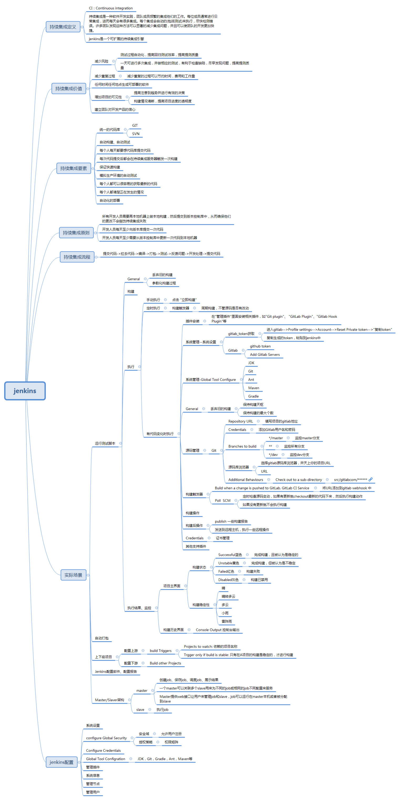

### 一、最佳实践

- 在类的头文件中尽量少引用其他头文件；
- 多用字面量语法，少用与之等价的方法；
- 多用类型常量，少用#define预处理指令；
- 用枚举表示状态、选项、状态码；

<!--more-->

### 二 快捷键

- Command + R 运行
- Command + . 停止
- Control + i 讲选中的代码格式化
- Command + control+ 上下箭头键  切换头文件和m. 文件
- Command + control+ 左箭头   回退，回到你上次打开的页面

###  零碎知识点

唐巧推荐提高篇:https://blog.devtang.com/2014/07/27/ios-levelup-tips/

1.1.[iOS 静态库，动态库与 Framework](https://skyline75489.github.io/post/2015-8-14_ios_static_dynamic_framework_learning.html)

1.2[从xib中自定义view的最佳姿势](https://www.jianshu.com/p/62e4a24422cf)

1.3 iOS15 导航器适配记录https://www.jianshu.com/p/366852d6c87b

1.4 UITableView 分组高度显示异常处理方案http://events.jianshu.io/p/e33a5576a81b

1.5 ios15适配汇总 https://www.jianshu.com/p/3e1f0ce35bd5

1.6 [在Xib中进行UIScrollView布局](https://www.jianshu.com/p/3161da83ee42)

1.7 [NSURLProtocol 应用场景](https://zhuanlan.zhihu.com/p/119524274)

1.8 [NSURLProtocol进行网络拦截](https://juejin.cn/post/6844903885513949192)

1.9 crc校验 [几种CRC16计算公式、初始值、标志位等参数汇总](https://blog.csdn.net/htmlxx/article/details/17369105?utm_medium=distribute.pc_relevant.none-task-blog-BlogCommendFromBaidu-3.not_use_machine_learn_pai&depth_1-utm_source=distribute.pc_relevant.none-task-blog-BlogCommendFromBaidu-3.not_use_machine_learn_pai)

2.1 [UIViewController 的生命周期](https://www.jianshu.com/p/d60b388b19f5)

2.2 [企业应用包部署到个人服务器](https://blog.csdn.net/u011072139/article/details/105027057/)

2.3[ iOS如何完美的修改项目名称](https://www.jianshu.com/p/2887d6fb5769)

2.4 [pod install 报错 出现 “Failed to connect to github.com port 443: Operation timed out”解决方案](https://www.jianshu.com/p/430819c157af)

2.5 [UIPageViewController使用](https://juejin.cn/post/6844903574325968909)

2.6 [http三次握手四次挥手](https://yuanrengu.com/2020/77eef79f.html)

2.7 [Charles 功能介绍和使用教程](https://juejin.cn/post/6844903665304600589#heading-57)   [charles抓包显示乱码解决方法](https://www.oschina.net/action/GoToLink?url=https%3A%2F%2Fwww.codeprj.com%2Fblog%2F7064811.html)

2.8 [Jenkins 实现 iOS 项目自动打包](https://juejin.cn/post/6920469161021816846#heading-7)

### 组件化

iOS组件化拆分https://www.jianshu.com/p/760d6cd46719

关于私有pod库依赖私有库 https://juejin.cn/post/6844903856854450184

### 面试常备

Swift 中Class 和 Struct 的区别(类和结构体)
https://juejin.cn/post/6844903894762389512

深浅拷贝
https://www.cnblogs.com/beckwang0912/p/7212075.html

pod install与pod update的区别
https://juejin.cn/post/6844903639966826510

masonry 修改约束动画
https://juejin.cn/post/6844903544911314957

面试知识整理
https://hit-alibaba.github.io/interview/
https://juejin.cn/post/6908303868086452237
https://github.com/miniLV/Interview-series
