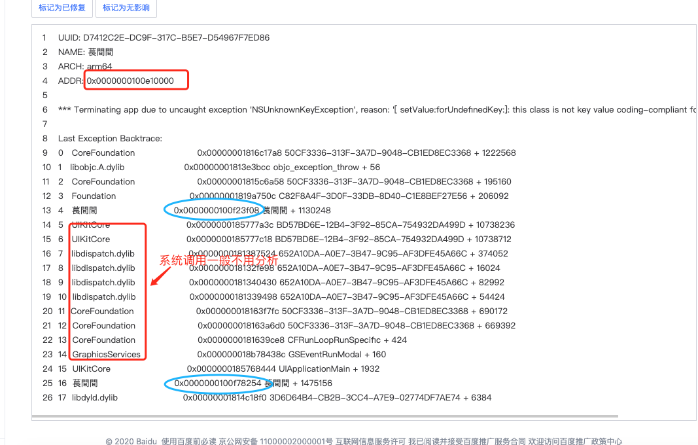
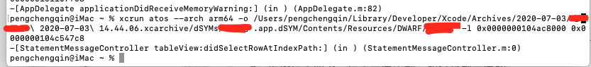

因为线上统计用的百度sdk,现在记录下针对百度错误日志的手动分析方法,其官网文档有[自动](https://mtj.baidu.com/static/userguide/book/ios/adconfig/crash/auto.html)和[手动](https://mtj.baidu.com/static/userguide/book/ios/adconfig/crash/manual.html)分析两种方法.

这里记录一下自己手动定位crash报错方法的流程:

百度移动统计iOS SDK获取的crash日志不是完整的系统生成日志，其内容主要包括异常类型、原因、Backtrace调用等.

SDK V3.5及以上的SDK，日志格式会在头部新增相关信息，如下:

```
UUID: 538572BD-D973-3D55-A475-4579BA0BECBF
NAME: BaiduMobStatSample
ARCH: x86_64
ADDR: 0x100000000
```

**bug分析命令：****xcrun atos --arch arm64 -o +包路径 -l 基地址 + 偏移地址**

<!--more-->

1、获取包路径

 （1）XCode->Window->Organizer


（2）找到对应的安装包并双击点击show in Finder


（3）双击.xcarchive文件显示包内容


（4）双击.app.dsYM文件显示报内容


（5）按照如下路径找到APP名字的文件


（6）打开终端输入(xcrun atos -arch arm64 -o )然后（将appname文件拖到此处，如下图）


（7）输入（-l）+ (崩溃日志中的ADDR如下图) + （APPname后面对应的一串字符如下图的蓝圈内的地址）输入完成之后回车就可以了




8、最终结果如下，会解析出类名，和报错的行数

