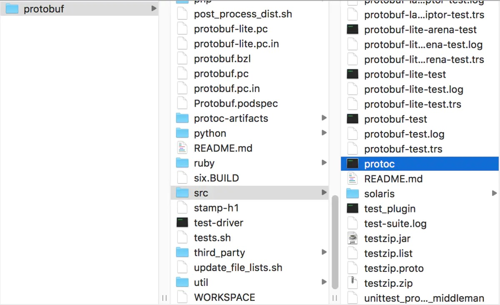
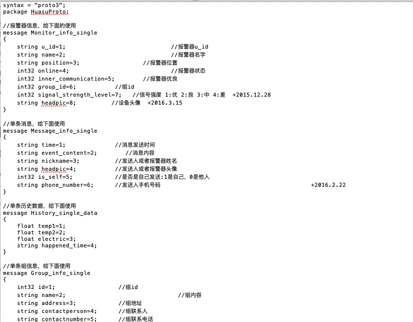
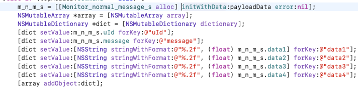

**为什么使用protobuf**

在不同平台通信的时候，首先需要将对象进行序列化。iOS平台上我们常用NSKeyedArchiver进行归档，当然也可以将数据处理为JSON或者XML格式。NSKeyedArchiver只能在iOS/Mac平台使用，因此它归档的二进制数据不适合于在不同平台之间使用。JSON和XML虽然由于容易维护，易读而应用比较广泛，但是对数据的利用效率都不是高。这时候该使用Protobuf了,因为Protobuf的优势是效率高，同样的一份数据使用protobuf存储的时候更小，更加方便

**Protobuf是什么**

Protobuf 即 google protocol buffer 是一种数据封装格式协议,是google推出的一种语言无关、平台无关、扩展性好的用于通信协议、数据存储的结构化数据串行化方法。

**使用Protobuf大致分三步:**

 1.集成protoc工具
 2.根据自己的需求创建proto文件并转换
 3.向自己的项目集成protocbuf

<!--more-->

### 一、集成protoc环境

##### 1.[下载protoc项目](https://link.jianshu.com?t=https%3A%2F%2Fgithub.com%2Fgoogle%2Fprotobuf.git)

##### 2.生成protoc编译器

cd到下载目录，终端依次执行以下命令

```undefined
./autogen.sh
./configure
make
sudo make install
objectivec/DevTools/full_mac_build.sh
```

成功后在src文件夹下会有个protoc文件




### 二、使用protoc转换文件

##### 1.根据需求新建后缀为proto的文件,例: XXXX.proto



##### 2.转换

```undefined
protoc --proto_path=路径1 --objc_out=路径2 XXXX.proto
```

路径1 : 创建的proto文件所在目录
 路径2 : 转换后的文件输出路径
 XXXX.proto : 创建的proto文件名称
 例:
 在桌面创建放proto文件的文件夹 "MySrc", 在 "MySrc" 里创建proto文件auth.proto,  在桌面创建放转换后的文件的文件夹 "MyGen", 则在终端
 先cd 到桌面

```undefined
protoc --proto_path=MySrc --objc_out=MyGen MySrc/XXX.proto
```

执行命令后会发现在 "MyGen" 文件夹中出现 XXX.pbobjc.h  /  XXX.pbobjc.m, 这两个就是我们项目中需要的文件。

### 三.向项目集成protobuf

将生成的Objective-C文件（上面例子的XXX.pbobjc.h和XXX.pbobjc.m）放到项目中，如果项目使用了ARC,要将.m（例子的XXX.pbobjc.m）的Complier Flags设为-fno-objc-arc。（protobuf基于性能原因没有使用ARC）

**加入protobuf库**，有两种方式

- 第一种是使用CocoaPods集成

  - 使用CocoaPods集成，有一个现成的pod可以使用–Protobuf,可以pod search Protobuf搜索查看详情，pod内容为 

  ```
  pod 'Protobuf'
  ```

- 第二种是把相关文件拖入项目中。

  - 拖入相关文件到项目中，将objective-c文件夹下的所有的.h文件和.m文件（除了GPBProtocolBuffers.m）(GPB开头的那些文件)以及整个google文件夹add到项目中，如果项目中使用了ARC需要将以上所有.m文件的的Complier Flags设为-fno-objc-arc。缺点是操作麻烦点，如果用了ARC的话还要手动添加-fno-objc-arc（使用CocoaPods集成会自动添加）,记得添加User Header Search Paths为$(PROJECT_DIR)/项目名/后接文件地址 不然头文件会报错

##### 完成，可以使用这个类进行操作了。

