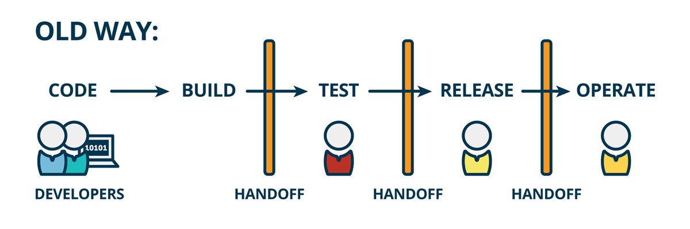
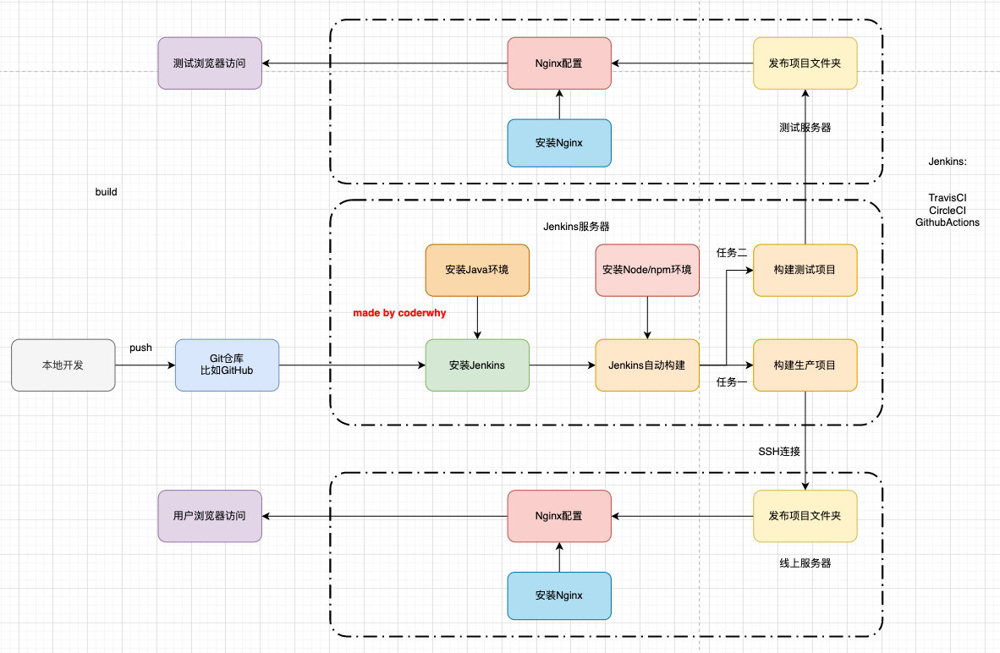

### 传统的开发模式

在传统的开发模式中，开发的整个过程是按部就班就行：



**但是这种模式存在很大的弊端：**

工作的不协调：开发人员在开发阶段，测试和运维人员其实是处于等待的状态。等到测试阶段，开发人员等待测试反馈 bug，也会处于等待状态
线上 bug 的隐患：项目准备交付时，突然出现了 bug，所有人员需要加班、等待问题的处理

<!-- more -->

### DevOps开发模式

DevOps 是Development 和 Operations 两个词的结合，将开发和运维结合起来的模式：

#### 持续集成和持续交付

伴随着 DevOps 一起出现的两个词就是持续集成和持续交付(部署)：

**CI 是 Continuous Integration（持续集成）**
**CD** 是两种翻译：Continuous Delivery（持续交付）或 Continuous Deployment（持续部署）

**持续集成 CI：**

开发人员编写代码上传到代码仓库，让持续集成的服务器立马对代码进行测试构建，对其进行测试，如果结果有问题直接反馈开发人员. 不过这个都处理完结果是没有进行部署的，所有还有一个概念是持续交付


**持续交付和持续部署 CD**

把项目交给项目经理，项目经理对其进行部署，可能是自动化部署也可能是手动化部署
在持续集成基础上会再进行一些测试，测试没有问题会打一个 release 版本


### Web自动化部署流程



**搭建服务器环境**

请提前准备一台云服务器,阿里云或者腾讯云都可以,没有也可以考虑本地搭建服务器环境

#### ngnix部署web项目

web部署需要用到nginx

**安装nginx**

```
$ dnf install nginx

```

**启动 nginx**

```
$ systemctl start nginx
$ systemctl status nginx
$ systemctl enable nginx
$ systemctl restart nginx
```

**配置nginx访问你打包的文件**

通过 Linux 命令创建文件夹和文件，并把你的web项目上传到你创建的文件夹下

```
$ mkdir /root/test
$ cd /root/test  
```

配置 nginx 访问目录,修改两处

```
/etc/nginx/nginx.conf
```

```
# user nginx;
user root;

server {
  location / {
    root /root/test;
    index index.html;
  }
}

```

####  Jenkins安装与配置

##### 安装 Java 环境

Jenkins 本身是依赖 Java 的，所以我们需要先安装 Java 环境

```
$ dnf search java
$ dnf install java-17-openjdk
```

##### 安装 Jenkins

因为 Jenkins 本身是没有在 dnf 的软件仓库包中的，所以我们需要连接 Jenkins 仓库

- wget 是 Linux 中下载文件的一个工具，`-O` 表示输出到某个文件夹并且命名为什么文件
- rpm：全称为 **The RPM Package Manage**，是 Linux 下一个软件包管理器

```
$ wget –O /etc/yum.repos.d/jenkins.repo http://pkg.jenkins-ci.org/redhat-stable/jenkins.repo

# 导入GPG密钥以确保您的软件合法
$ rpm --import https://pkg.jenkins.io/redhat/jenkins.io.key
# 或者
$ rpm --import http://pkg.jenkins-ci.org/redhat/jenkins-ci.org.key
```

编辑 /etc/yum.repos.d/jenkins.repo文件

通过 vim 编辑

$ vim /etc/yum.repos.d/jenkins.repo

```
[jenkins]
name=Jenkins-stable
baseurl=http://pkg.jenkins.io/redhat
gpgcheck=1
```

安装 Jenkins

```
$ dnf install jenkins # --nogpgcheck(可以不加)
```

启动 Jenkins 的服务

```
$ systemctl start jenkins     # 手动启动 Jenkins
$ systemctl status jenkins
$ systemctl enable jenkins    # 开机自启动 Jenkins
$ systemctl restart jenkins   # 重启 Jenkins
```

Jenkins 默认使用 8080 端口提供服务，所以需要已加入到esc安全组中：


##### 配置Jenkins

现在可以打开服务器：8080进入如下


获取输入管理员密码,远程终端输入：

```
cat /var/lib/jenkins/secrets/initialAdminPassword
```

插件安装请选择推荐插件


插件正在安装中，请耐心等待


插件安装完成以后将会创建管理员账户，如下图所示

##### 新建Jenkins 任务


##### **选择Jenkins 任务配置**


**因为需要使用到git，需要系统安装git**

```
$ dnf install git
```


##### **构建触发器**

这里的触发器规则是这样的：定时字符串从左往右分别是：分 时 日 月 周

```
# 每半小时构建一次OR每半小时检查一次远程代码分支，有更新则构建
H/30 * * * *

# 每两小时构建一次OR每两小时检查一次远程代码分支，有更新则构建
H H/2 * * *

# 每天凌晨两点定时构建
H 2 * * *

# 每月15号执行构建
H H 15 * *

# 工作日，上午9点整执行
H 9 * * 1-5

# 每周1、3、5，从8:30开始，截止19:30，每4小时30分构建一次
H/30 8-20/4 * * 1,3,5
```

##### 构建环境node


**我们需要搭建 Node 的环境**

1. 第一步：配置 Node 的环境

2. 第二步：安装 Node 的插件

   

   第一步：安装 Node 的插件

   

   第二步：安装指定的 Node 版本

   

**node环境装好后，选择shell脚本完成自动打包部署**


```
pwd
node -v
npm -v
npm install 
npm run build
pwd
echo '构建成功'
ls

# 删除/root/test文件夹里所有的内容
rm -rf /root/test/* 
cp -rf ./dist/* /root/test/
```

正常情况，jenkins只能控制当前自己的文件夹(工作空间)，没有权限进入其他文件夹，这时如果需要进入其他的目标文件夹


解决办法:

方案1:修改jenkins执行时使用的用户组，修改为root

修改文件的路径: /etc/sysconfig/jenkins


之后重启一下jenkins;

方案2: sudo usermod -a -G root jenkins    将jenkins添加到root组中

方案3: chown -R jenkins /root/项目目录                 给jenkins目录权限 (采用此方案搞定)


**至此一个自动化任务就完成了！**


