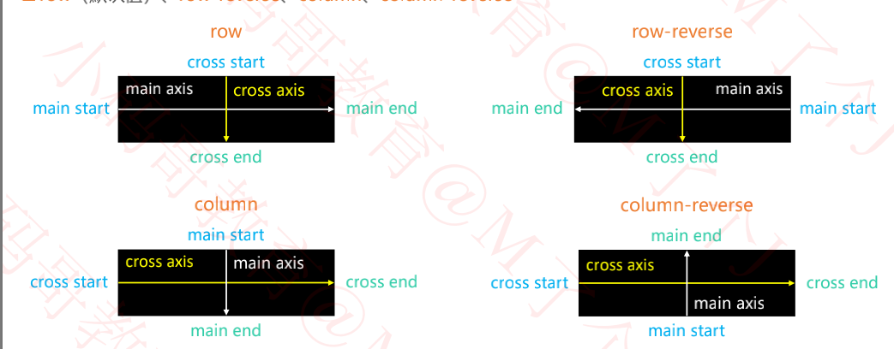
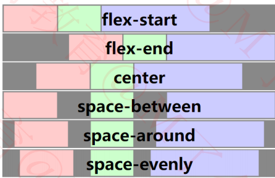
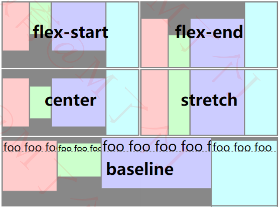
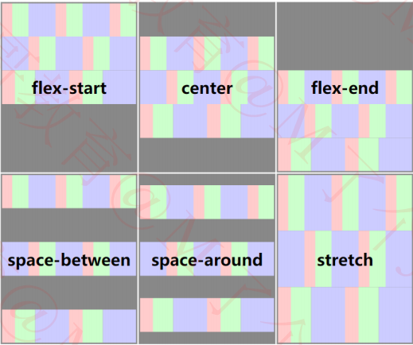

尺寸单位rpx,规定屏幕宽为750rpx

### flex布局

flex布局是小程序经常使用布局方式

开启方式:       display:flex; (black-level形式存在) 或 display:inline-flex; (inline-level形式存在)

开启flex布局的元素叫flex container,其中直系子元素叫做flex items

<!-- more -->

#### 属性

**flex-derection决定了main axis的方向**

属性值: row | row-reverse | column | column-reverse

**justify-content决定了flex items在main axis上的对其方式**

flex-start(默认值):与main start对齐

flex-end:与main-end对齐

center:居中对齐

space-between:items之间的距离相等,与main-start,main-end两端对齐

Space-evenly:items之间的距离相等,items与main-start,main-end之间的距离等于items之间的距离.

Space-around:items之间的距离相等,与main-start,main-end之间的距离等于items之间的距离的一半

**Align-items决定了在cross axis上的对其方式**

stretcha(默认值):当flex-items在cross axis方向的size为auto时,会自动拉伸至填充flex container

Flex-start:与cross start对齐

Flex-end:与cross end对齐

center: 居中对齐

Baseline:与基准下对齐

**Flex-wrap决定了flex container是单行还是多行**

nowrap(默认):单行

wrap:多行

Wrap-reverse:多行(对比wrap,cross start与cross end相反)

**flex-flow是flex-derection || flex-wrap的简写**

比如flex-flow:column wrap等价于

Flex-derection:colunm

Flex-warp:warp

**Align-content决定了多行flex items在cross axis上的对齐方式,用法与justify-content类似**

stretch(默认值):与align-items的stretch类似

Flex-start:与cross start对齐

Flex-end:与cross end对齐

Center:居中对齐

Space-between:items之间的距离相等,与cross-start,cross-end两端对齐

Space-around:items之间的距离相等,与cross-start,cross-end之间的距离等于items之间的距离的一半

Space-evenly:items之间的距离相等,items与cross-start,cross-end之间的距离等于items之间的距离.

**order决定了flex items的排布顺序**

可以设置任意整数(正负数/0),值越小就越排在前面

默认值为0

**Align-self**

flex items可以通过align-self覆盖flex contaner设置的align-items

auto(默认值):遵从flex container的align-items设置

Stretch/flex-start/flex-end/center/baseline

**Flex-grow决定了flex items如何扩展多余空间**

可以设置任意非负数字(正数/0),默认值是0

当flex container在main axis方向上有剩余size时,flex-grow属性才有效

**flex-shrink决定了flex items如何收缩**

可以设置任意非负数字(正数/0),默认值是1

当flex itemx在main axis方向上超过了flex container的size,flex-shrink属性才有效

**flex-basis用来设置flex items在main axis方向上的bese size**

auto(默认值):

content:取决于内容本身的size

决定了flex items最终base size的因素,游戏那几从高到低

Max-width\max-height\min-width\min-height

Flex-basis

Width\height

内容本身的size

**flex是flex-grow flex-grow flex-shrink? || flex-basis的简写**

默认值 0 1 auto

none:0 0 auto