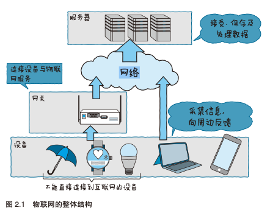

感觉物联网现在越来越热门,智能家居/工业物联网应用越来越多,于是想全面的连接物联网基本知识结构,所以看了该书.感觉不错,本书从硬件到软件到物联云,系统了讲解了开发物联网应用需要的知识.

 全书看下来,感觉当前还是处于物联网初期,感觉物联网应用的比较多的还是工业,智能家居也有不少的用户开始接受了,但是比较零散,很多没有形成系统,很多设备只是简单了添加联网模块,未给硬件添加智能化和自动化,不过自动驾驶应该是一项技术突破,设计到n多传感器和自动化驾驶.